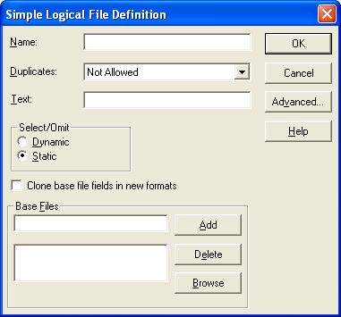

<table>
			    <tr>
			      <td>
				   [ASNA DataGate&#174; for SQL Server Reference Manual
				   ](Welcome.html)</td>
			    </tr>
</table>

# File Creation

---

###  Creating "Files" in SQL Server 
As part of the basic strategy to give SQL Server the semantics of DB2/400, DataGate&#174; for SQL Server (DSS) was built to permit as much manipulation as possible of the underlying objects directly, via native SQL commands. As a consequence of this strategy, it was decided that there would be no artificial structure imposed on the tables and views used to implement the concept of physical and logical files. Files were then implemented as follows: 

- A **Physical file**  is implemented as a **Table** . An Indexed Physical file requires an Index with the same name as the Table.
- A **Simple Logical file**  is implemented as a **View** . An Indexed Simple Logical file requires an Index with the same name as the View.
- A **Join Logical file**  is implemented as a **View** . An Indexed Join Logical file requires an Index with the same name as the View. 
    This index marks which table is considered the **'primary file'** .

When a simple logical file is created, it is possible to establish the underlying 'Select' in two ways: 

- Select individual columns from the table.
- Select all columns via a '<code>Select * from TableX</code>' by checking the 'Clone base file fields in new format' check box.

In either case, the <code> **SCHEMABINDING** </code> option is not used; this permits the table to be altered, thus new columns can be added to an existing table without having to drop the views first. However, SQL Server does not reflect the new columns in the corresponding views (those with the 'Select * ' command) until such views are recreated. 

This is a natural behavior of SQL Server views and DSS does not alter it. Notice also that DSS does not provide a way to add new fields to a file, so the aforementioned procedure has to be done using the Microsoft SQL Server Management Studio. 
