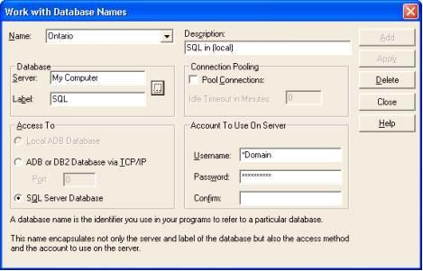
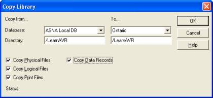
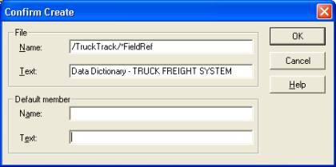
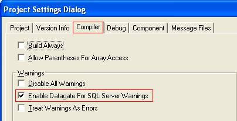

<table>
			    <tr>
			      <td>
				   [ASNA DataGate&#174; for SQL Server Reference Manual
				   ](Welcome.html)</td>
			    </tr>
</table>

# Porting AVR .NET Applications to Employ ASNA DataGate&#174; &#174; for SQL Server&#174;

## Introduction 
ASNA's DataGate&#174; for SQL Server (DSS) provides AVR programmers access to Microsoft SQL Server through native RPG file IO using familiar RPG operation codes such as <code>CHAIN</code> and <code>SETLL</code>. DSS allows you to write one set of applications that works concurrently with both the iSeries and *SQL Server* databases. 

You will **not** need to learn SQL to get effective access to *SQL Server* . The skills you use today for iSeries file IO will work exactly the same way for *SQL Server* via DSS. The same AVR programs that connect to *SQL Server* will seamlessly connect to the iSeries and ASNA's DataGate&#174; engine. 

DSS makes a *SQL Server* instance appear as a database similar to DataGate&#174; for IBM i. The characteristic features of DB2/400 materialize on *SQL Server* when seen through the eyes of DSS. With DSS, you can use the Library list, Physical and Logical files, DB2 field types like packed and zoned, and Data Areas. 

###  Some Restrictions Apply 
Even though DSS tries to make *SQL Server* look like DB2/400, there are several features that cannot be implemented in a totally transparent fashion. The *SQL Server* database engine is of a different design and implementation than the IBM i and DataGate&#174; engines. 

The intent of this document is to help you become aware of the items that will most likely affect your application and the process of using *SQL Server* as your database. Through it all, remember the goal you are seeking is to create applications that take advantage of the many features of *SQL Server* and to create applications that can run with either *SQL Server* or DB2/400 as the underlying database engine. 

In the next sections we'll deal with all of the issues that will need your attention, but the following items are probably the ones with the most impact for many users. 

####  No Multi-Format Logical Files: 
DSS implements a physical file through the use of a native *SQL Server* table. A logical file is implemented through a native view. *SQL Server* Views are single formatted in nature, so there is no support for multi-format logical data files. You will have to eliminate any reference to multi-format logical files in your application. 

Print files, although they are typically multi-formatted, are fully supported in DSS, however. 

####  Single Member Files: 
*SQL Server* doesn't have the concept of members of a table/view. DSS for .NET makes it appear as though each file had one (and only one) member; the member name is exactly the same as the file name. For the member name, you can use the exact name or the special values <code>*FIRST</code> and <code>*FILE</code>. You should be careful when using the Copy Data and Copy Library tools of DataGate&#174; Studio to copy a file from DataGate&#174; or IBM i, because they default to <code>*SAME</code> for the target member name; if the source member name was different than the file name, the copy will fail. 

Some support for multi-member files was added in 14.0, for more information see DSS 

####  Logical Field Restrictions: 
There are two restrictions on the usage of logical fields when they change the name or the type of their corresponding base physical field. When the field is retyped, most typically because the field is a concatenation or substring of the physical, then the field becomes read only. A logical field, whose name has changed from its physical base field, can't be used as a key field in the logical file. 

####  Unlocking Records: 
This is probably the most demanding area of application adaptation between the differences of implementation between IBM i method of record locking and that of the *SQL Server* database engine. The problem arises in two areas: Using the <code>*nolock</code> keyword on the read operations and on the implementation of the <code>UNLOCK</code> command. 

DSS for .NET uses *SQL Server* 'Server Cursors' to implement file access. When a file is opened for update, it is not possible to tell *SQL Server* to not lock the record on a read, so a read with <code>*nolock</code> has no effect for files opened for Update. There are two methods to resolve this problem: 

1. Declare a second instance of the file marked as input only and use it wherever the NoLock option would have been given on a read/chain.
2. Retain the <code>*nolock</code> and follow the read/chain with an <code>UNLOCK</code> command. Be aware this method imposes some
	restrictions as stated in the next paragraph.

The <code>UNLOCK</code> command leaves the cursor in a no-position state, meaning you can't perform a subsequent read (next/previous) without repositioning the file with a <code>SETLL</code>, <code>SETGT</code>, or <code>CHAIN</code>. 

###  The Process 
In a nutshell, the process of upgrading your application is composed of the following steps: 

3. Get a reasonably powerful PC
4. Move your data from the IBM i or DataGate&#174; Engine to *SQL Server*
5. If necessary, modify your application to adapt to any new restrictions
6. Optimize your application to take advantage of several AVR op-codes

####  1. Computer Size 
*SQL Server* is very demanding on computer resources. We recommend you get a computer with at least the capacity of the cheapest machine you can get from Dell, but with twice the amount of memory. The machine doesn't have to be a Dell computer, but use the Dell machine as a reference to configure your box. 

#### 2. Move Your Data 
Create a Database Name: 

The first step after installing DataGate&#174; for SQL Server on your machine is to **create a Database Name** that points to your ** *SQL Server* ** . You can use the **Database Wizard** or the **Work with Database Names** option of the **Database** menu of Database Manager. 

Under typical SQL Server installations, there is only one instance of the server installed on the machine and that instance typically contains the following databases: 

- Master
- Model
- Msdb
- Northwind
- Pubs
- Tempdb

Each one of these databases will be presented through DSS for .NET as individual libraries. Since all databases are shown under a common database name, the &quot; **Label'** parameter of a database name pointing to DataGate&#174; 16.0 for SQL Server must be &quot; **SQL** &quot;. 

The following figure shows a Database Name called **Ontario** pointing to the **SQL Server** engine in **My Computer** 

 

You can use <code> ***DOMAIN** </code> for your user name or you can supply one of the login names recognized by SQL Server with its corresponding password. 

Open the Database: 

Test your Database Name by opening the database with Database Manager. You should see something like the following: 

 

When you open a database for the first time, Database Manager prompts you for your viewing preferences for the database with a dialog like the following. 

 

Notice in particular the checkbox **Show system objects** . It controls whether to or not to display a set of *SQL Server* objects called **sysxxxx** . For IBM i databases, this option shows or hides objects like <code>QSYS</code>. 

####  Prepare Files and Copy Libraries: 
The next step in moving your data is to prepare a library (or libraries) on the source machine with all the files you wish to copy to the target *SQL Server* . 

After you have prepared the library, use the **Copy Library** option from the **Tool** menu to move the data. 

You can use one of your existing libraries, but it may require some clean up before it is ready. To check your data, use one of the options below: 

7. You can do a <a href="#Visual_Inspection">Visual Inspection</a> of the files in the library to verify/modify them to comply with the check list.
8. Alternatively <a href="#Copy_Command">issue the **copy**  command</a> and wait for it to tell you whether there are any problems.

#### Visual Inspection Using a Checklist:
**Use the following checklist** to ensure a DataGate&#174; or IBM i data file will be successfully copied to *SQL Server* : 

**The file must have:** 

- only one member
- the member name the same as the file name
- only one format
- maximum of 16 key fields
- maximum key length of 900 bytes
- maximum of 1024 fields
- maximum record length of 8060 bytes

Logical files have extra restrictions. Make sure that the key fields are not substrings or concatenations of physical fields and that the name of the logical field is the same as that of its base field. 

####  Issue the Copy Command and Note if there are any Problems 
If you choose the second option, uncheck the **Copy Data Records** in the **Copy Library** dialog to speed up the process. Take note of any problem and after fixing it, delete the target library and issue the **Copy Library** command again, this time copying the data records. You can view the result of the copy in the **Message Log** window. 

 

####  Copy Library: 
Once you have modified your files to comply with the limitations stated above, you can use the **Copy Library** menu option. 

 

All files stored under *SQL Server* must reside inside a **'Library'** just like files on an IBM i. DataGate&#174; Engine has allowed files to be placed at the 'root' level of the database and under subfolders inside a library. If you have files in places other than first level libraries, you'll have to adapt your application (or the library list) to point to the new locations. 

When a physical file is copied to *SQL Server* , a **table** is created with the name of the physical file. For logical files, a **view** is created. In either case, if the file is keyed, an index is created on the table; for logical files the index is created on the primary base table. 

When a view is encountered through DSS for .NET, it is reported as being a new kind of logical file, called **SQL Logical** . That is why when a logical file is copied, regardless of whether a logical file is a **Simple Logical** or a **Join Logical,** it will appear on the *SQL Server* database as a **SQL Logical** file. 

####  Field Reference Files 
Field Reference Files are used on the iSeries to collect definitions of named field types that are used in the creation of data files. *SQL Server* has a built-in data dictionary where user types can be defined. DSS surfaces this data dictionary through the special file <code>*FieldRef</code>. There is one <code>*FieldRef</code> file per library. 

If you use a field reference file as part of your data file definitions, you should first import those fields into the data dictionary of the *DSS* library. 

**Follow these steps to populate the dictionary:** 

9. Open the source database.
10. Drag the field reference file to the **Work Definition Area**
11. Open the target database.
12. Create the target library.
13. Drag the field reference file to the target database taking care of specifying <code> ***FieldRef** </code> as the file name to be
        created. DSS will notice the special name and add the fields to the data dictionary.

After you have populated the data dictionary, you can view the type definitions by clicking on the <code>*FieldRef</code> file in the target library.  If you don't see the <code>*FieldRef</code> file in the library, ensure that the option to **Show System Objects** checked ON in the options dialog. 

####  3. Adapt the Application 
Enable DataGate&#174; for SQL Server Warnings: 

To assist in finding areas in code that will potentially cause an error, a new IDE option has been added to ASNA Visual RPG to give warnings for invalid operations under DSS. This option is located within the " **Compiler** " Tab of the **Project &gt;Settings** menu option. 

Select the **Enable DataGate&#174; for SQL Server Warnings** option so that a check mark appears in the check box and select **OK** . 

 

###  Change your <code>DCLDISKFILE</code> Statements: 
Depending upon your application, the following are some changes you will/may need to make to your <code>DCLDISKFILE</code> statements. 

<code>*Arrival</code> processing: 

**Arrival sequence processing** must be changed to indexed processing. *SQL Server* doesn't have the concept of a relative record number (RRN). 

The simplest method for handling this would be to employ the use of a key field in the file. If the file is being processed only in consecutive fashion (i.e. you don't use random op-codes like <code>SETLL</code> or <code>CHAIN</code> on the file) then you can choose any field to be the key and specify <code>RANDOM(*NO)</code> in the <code>DCLDISKFILE</code>. If you do process the file randomly, then you will need to add a field to the file to simulate the RRN sequence. The easiest way to achieve this is by adding an identity field called **RecNum** of type **integer** . 

Format names: 

 In DSS, the record format name is always " **R" + Filename**  If the record format name is anything else, **and** you've specified this record format name on I/O operations, a rename format will need to be specified on the <code>DCLDISKFILE</code> statement as follows. **RNMFMT(OldFormatName)** where *<code>OldFormatName</code>* is the name of the existing format. No changes will need to be made to the actual I/O statements. 

Query Files: 

If your application makes use of the Open Query File capability of DataGate&#174; or IBM i, you will have to take care of a couple of things. 

- The string passed in the <code>QrySelect</code> must comply with the syntax of *SQL Server* , for example you should use the word ' **and** ' not the symbol ' **&amp;** '.
- If you are changing the order of the file by providing a value in the <code> **QryKeyFlds** </code> parameter, then you must also specify <code> **RANDOM(*NO)** </code> in the <code>DCLDISKFILE</code> to state that you will be accessing this file only consecutively.

Check Format ID: 

If an application is going to run against both DSS and DataGate&#174; for IBM i, and your file currently contains **binary** fields, you will need to consider changing the field type. 

Unlocking Records: 

The behavior of DSS when the file is opened for update is similar to DG for IBM i, but with two significant differences: 

14. Updating a record does *not*  release the lock on the record.
15. Explicitly unlocking a record causes the 'current record position' to be lost.

These differences bear the following considerations: 

 

 Loops involving <code> **SetLL-SetGT** </code> and <code> **Read-ReadE-ReadPE** </code> should be re-coded to use the <code>Range</code> operations.  

The most demanding change is the one requiring segments of code involving <code>CHAIN-UPDATE</code> combinations to be studied and possibly modified. 

- If the <code>CHAIN-UPDATE</code> happens in a tight loop, then at the end of the loop, an <code>UNLOCK</code> should be 
        issued to release the last record updated. Notice however that the record position will be lost 
        after the <code>UNLOCK</code>.
- If the <code>CHAIN-UPDATE</code> is sprinkled throughout the code, then each case has to be closely studied.

####  4. Optimize Your Applications with AVR Op-Codes 
To optimize SQL Server processing and to enhance client/server performance with all supported database engines (IBMi/400, DataGate&#174; and SQL Server) with dynamic Network Blocking, AVR has 3 op-codes; <code>SetRange</code>, <code>ReadRange</code> and <code>DeleteRange</code>, as described below: 

I/O op-codes provide better performance in two ways: 

16. When working with large *SQL Server*  files, DSS is able to optimize 
        the record set selection operation.
17. Network Blocking becomes dynamic, in that records outside of the range are not
        transmitted to the client.

 **SetRange**  

Use the <code> **SETRANGE** </code> op-code in place of <code>SETLL</code> and <code>SETGT</code> when you're doing <code>SETLL/READE</code> and <code>SETGT/READPE</code> loops. 

 **ReadRange**  

Use the **<code>READRANGE</code>** op-code in place of the <code>CHAIN</code> op-code when you're doing <code>CHAIN/READE</code> loops. 

 **DeleteRange**  

Use the <code> **DELETERANGE** </code> op-code in place of <code>DELETE</code> loops. 
