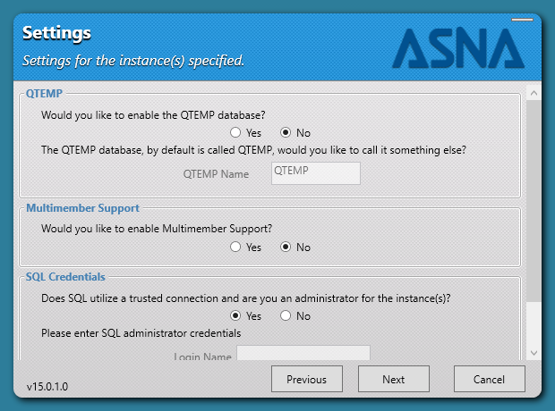
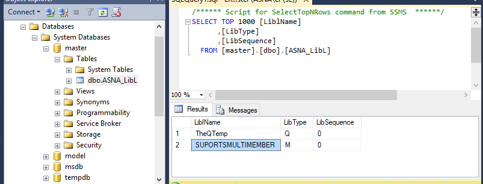

<table>
			    <tr>
			      <td>
				   [ASNA 
				   DataGate&#174; for SQL Server Reference Manual
				   ](Welcome.html)</td>
			    </tr>
</table>

# DataGate&#174; for SQL Server Multi-member File Support

---

Prior to 14.0, DataGate&#174; for SQL Server only supported the creation of Physical and logical files with zero to one member; with 14.0 DSS gained the ability to migrate Physical and logical files with any number of members. (Join files are still excluded.) DSS handles these two file types differently, although with similar ease.

#### Single Member Physical Files
Single member files include those with a maximum member value of zero or one; both are handled the same way:

The underlying SQL Server objects of Single Member Files are optimized to use a table that shares the name of the file. The member, if present, will already have the same name as the file.

Single Member Files are forced to have exactly one member, and the member's assumed name is the same name of the file. 

The member of a single member file cannot be renamed or deleted without doing the same to the file, and no new members can be added to the file.

#### Multi-member Physical Files
Multi=member files (any file with a maximum member value greater than one) are handled with a table that represents the file, and which shares the name of the file.   An additional table is created for each member using the naming convention <code> *FileName* # *MemberName* </code>. Each table contains the data from one member.

Changing the name of the File-table will change the *FileName* portion of the names of eaxh associated Member-table. Members can be freely added, deleted, and renamed (so long as they retain the *FileName* suffix.

This applies to both migrated files and files created through DataGate.

#### Single Member Logical Files
Single member files include those with a maximum member value of zero or one; both are handled the same way:

The underlying SQL Server objects of Single Member Files are optimized to use a table that shares the name of the file. The member, if present, will already have the same name as the file.

Single Member Files are forced to have exactly one member, and the member's assumed name is the same name of the file. 

The member of a single member file cannot be renamed or deleted without doing the same to the file, and no new members can be added to the file.

#### Multi-member Logical Files
Multi-member files (any file with a Maximum Member value greater than one) are handled by creating a view that represents the file, and which shares the name of the file.   An additional view is created for each member using the naming convention <code> *FileName* # *MemberName* </code>. Each view contains the data from one member.

Changing the name of the File-view will change the *FileName* portion of the names of eaxh associated Member-view. Members can be freely added, deleted, and renamed (so long as they retain the *FileName* suffix.

### Installation Configuration
Previously, any file with a <code>MaxMember</code> value other than "<code>1</code>" would throw an error. With multimember support active SQL instead treats each member as a separate file.

The implementation of this facility could break compatibility for older programs that set a <code>MaxMember</code> value greater than one while creating a new physical or logical file.  **ADBFM Classic** users are particularly at risk.

In order to preserve compatibility with these older programs, the support for files with more than one member is configurable.

Each DSS Server Installation can be configured to support multi-member files or be restricted to only support single member files.

Whenever a file is created on a restricted installation, the maximum number of members is forced to be one (1). 

The ability to restrict an installation to force single members was added in versions 14.0.44 and 15.0.30. These versions included an option in the DSS **ASNA Stored Procedures Wizard** (which runs immediately following the DSS Installation Wizard) to control the new behavior.

When an installation of these versions has been configured to support files with multiple members, there will be a row in the configuration table '<code>Master.dbo.ASNA_LibL</code>' with a LibType of '<code>M</code>' and a LiblName value of <code>SUPORTSMULTIMEMBER</code> as shown below:

