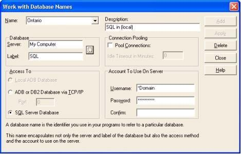
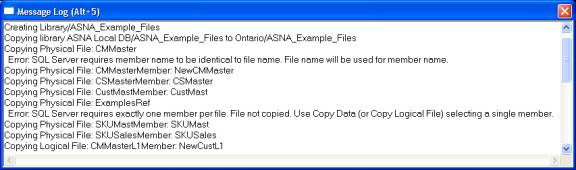
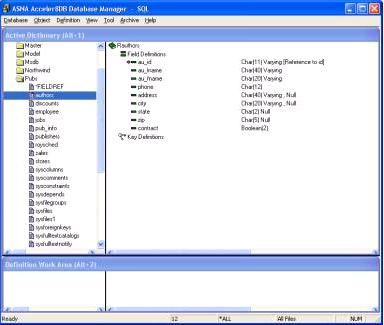
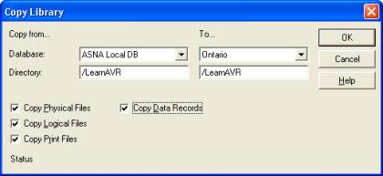
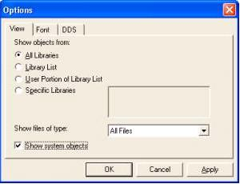
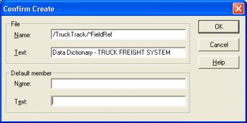
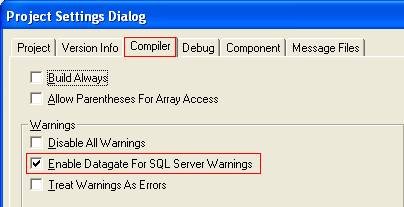
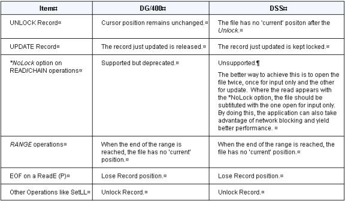

<table>
			    <tr>

			       <td> DataGate&#174; 16.0 for SQL Server Reference Guide
				    
				   </td>
			    </tr>
</table>

# Porting AVR.NET Applications: Process
In a nutshell, the process of upgrading your application is composed of the following steps: 

1. Get a reasonably powerful PC
2. Move your data from the IBM i or DataGate&#174; Engine to
 *SQL Server*
3. If necessary, modify your application to adapt to 
							any new restrictions
4. Optimize your application to take advantage of 
							several AVR op-codes

#### 1. Computer Size 
*SQL Server* is very demanding on computer resources. We recommend you get a computer with at least the capacity of the cheapest machine you can get from Dell, but with twice the amount of memory. The machine doesn't have to be a Dell computer, but use the Dell machine as a reference to configure your box. 

#### 2. Move Your Data 
Create a Database Name: 

The first step after installing DataGate&#174; for SQL Server on your machine is to **create a Database Name** that points to your ** *SQL Server* ** . You can use the **Database Wizard** or the **Work with Database Names** option of the **Database** menu of Database Manager. 

Under typical SQL Server installations, there is only one instance of the server installed on the machine and that instance typically contains the following databases: 

- Master
- Model
- Msdb
- Northwind
- Pubs
- Tempdb

Each one of these databases will be presented through DSS for .NET as individual libraries. Since all databases are shown under a common database name, the " **Label'** parameter of a database name pointing to DataGate&#174; 16.0 for SQL Server must be " **SQL** ". 

The following figure shows a Database Name called **Ontario** pointing to the **SQL Server** engine in **My Computer** 

 

 

You can use ***DOMAIN** for your user name or you can supply one of the login names recognized by SQL Server with its corresponding password. 

Open the Database:

Test your Database Name by opening the database with Database Manager. You should see something like the following: 

 

 

When you open a database for the first time, DataGate&#174; Studio prompts you for your viewing preferences for the database with a dialog like the following. 

 

 

Notice in particular the checkbox **Show system objects** . It controls whether to or not to display a set of *SQL Server* objects called **sysxxxx** . For IBM i databases, this option shows or hides objects like QSYS. 

#### Prepare Files and Copy Libraries: 
The next step in moving your data is to prepare a library (or libraries) on the source machine with all the files you wish to copy to the target *SQL Server* . 

After you have prepared the library, use the **Copy Library** option from the **Tool** menu to move the data. 

You can use one of your existing libraries, but it may require some clean up before it is ready. To check your data, use one of the options below: 

- 5. You can do a

								Visual Inspectionof the files in the 
								library to verify/modify them to comply with the 
								check list.
6. Alternatively

								issue the **copy**  command and wait for 
								it to tell you whether there are any problems.

#### Visual Inspection Using a Checklist:
**Use the following checklist** to ensure a DataGate&#174; or IBM i data file will be successfully copied to *SQL Server* : 

 **The file must have:** 

- only one member
- the member name the same as 
							the file name
- only one format
- maximum of 16 key fields
- maximum key length of 900 
							bytes
- maximum of 1024 fields
- maximum record length of 
							8060 bytes

Logical files have extra restrictions. Make sure that the key fields are not substrings or concatenations of physical fields and that the name of the logical field is the same as that of its base field. 

#### Issue the Copy Command and Note if there are any Problems
If you choose the second option, uncheck the **Copy Data Records** in the **Copy Library** dialog to speed up the process. Take note of any problem and after fixing it, delete the target library and issue the **Copy Library** command again, this time copying the data records. You can view the result of the copy in the **Message Log** wwindow. 

 

#### Copy Library:
Once you have modified your files to comply with the limitations stated above, you can use the **Copy Library** menu option. 

 

All files stored under *SQL Server* must reside inside a **'Library'** just like files on an IBM i.  DataGate&#174; Engine has allowed files to be placed at the 'root' level of the database and under subfolders inside a library. If you have files in places other than first level libraries, you'll have to adapt your application (or the library list) to point to the new locations. 

When a physical file is copied to *SQL Server* , a **table** is created with the name of the physical file. For logical files, a **view** is created. In either case, if the file is keyed, an index is created on the table; for logical files the index is created on the primary base table. 

When a view is encountered through DSS for .NET, it is reported as being a new kind of logical file, called **SQL Logical** . That is why when a logical file is copied, regardless of whether a logical file is a **Simple Logical** or a **Join Logical,** it will appear on the *SQL Server* database as a **SQL Logical** file. 

#### Field Reference Files 
Field Reference Files are used on the iSeries to collect definitions of named field types that are used in the creation of data files. *SQL Server* has a built-in data dictionary where user types can be defined. DSS surfaces this data dictionary through the special file *FieldRef. There is one *FieldRef file per library. 

If you use a field reference file as part of your data file definitions, you should first import those fields into the data dictionary of the *DSS* library. 

**Follow these steps to populate the dictionary:** 

7. Open the source database.
8. Drag the field reference 
							file to the **Work Definition Area**
9. Open the target database.
10. Create the target library.
11. Drag the field reference 
							file to the target database taking care of 
							specifying ***FieldRef**  as the file name to be 
							created. DSS will notice the special name and add 
							the fields to the data dictionary.

								<li>
12. 

</li>

After you have populated the data dictionary, you can view the type definitions by clicking on the *FieldRef file in the target library.  If you don't see the *FieldRef file in the library, ensure that the option to **Show System Objects** is checked is checked ON in the options dialog. 

####  3. Adapt the Application
Enable DataGate&#174; for SQL Server Warnings: 

To assist in finding areas in code that will potentially cause an error, a new IDE option has been added to ASNA Visual RPG to give warnings for invalid operations under DSS. This option is located within the " **Compiler** " Tab of the **Project &gt;Settings** menu option. 

Select the **Enable DataGate&#174; for SQL Server Warnings** option so that a check mark appears in the check box and select **OK** . 

 

### Change your DCLDISKFILE Statements:
Depending upon your application, the following are some changes you will/may need to make to your DCLDISKFILE statements. 

*Arrival processing: 

**Arrival sequence processing** must be changed to indexed processing. *SQL Server* doesn't have the concept of a relative record number (RRN). 

 The simplest method for handling this would be to employ the use of a key field in the file. If the file is being processed only in consecutive fashion (i.e. you don't use random op-codes like SETLL or CHAIN on the file) then you can choose any field to be the key and specify RANDOM(*NO) in the DCLDISKFILE. If you do process the file randomly, then you will need to add a field to the file to simulate the RRN sequence. The easiest way to achieve this is by adding an identity field called **RecNum** of type **integer** . 

 Format names: 

 In DSS, the record format name is always " **R" + Filename** . If the record format name is anything else, **and** you've specified this record format name on I/O operations, a rename format will need to be specified on the DCLDISKFILE statement as follows. **RNMFMT(OldFormatName)** where OldFormatName is the name of the existing format. No changes will need to be made to the actual I/O statements.  

 Query Files: 

If your application makes use of the Open Query File capability of DataGate&#174; or IBM i, you will have to take care of a couple of things.  

- The string passed in the QrySelect must comply with the syntax of *SQL Server* , for example you should use the word ' **and** ' not the symbol ' **&amp;** '.
- If you are changing the order of the file by providing a value in the **QryKeyFlds** parameter, then you must also specify **RANDOM(*NO)** in the DCLDISKFILE to state that you will be accessing this file only consecutively.

 Check Format ID: 

If an application is going to run against both DSS and DataGate&#174; 400, and your file currently contains **binary** fields, you will need to consider changing the field type.  

 Unlocking Records: 

The behavior of DSS when the file is opened for update is similar to DG/400, but with two significant differences:  

13. Updating a record does *not*  release the lock on the record.
14. Explicitly unlocking a 
							record causes the 'current record position' to be 
							lost.

These differences bear the following considerations: 

 

Loops involving **SetLL-SetGT** and **Read-ReadE-ReadPE** should be re-coded to use the Range operations.  

The most demanding change is the one requiring segments of code involving CHAIN-UPDATE combinations to be studied and possibly modified. 

- If the CHAIN-UPDATE happens 
							in a tight loop, then at the end of the loop, an 
							UNLOCK should be issued to release the last record 
							updated. Notice however that the record position 
							will be lost after the UNLOCK.
- If the CHAIN-UPDATE is 
							sprinkled throughout the code, then each case has to 
							be closely studied.

#### 4. Optimize Your Applications with AVR Op-Codes 
To optimize SQL Server processing and to enhance client/server performance with all supported database engines (iSeries/400, DataGate&#174; and SQL Server) with dynamic Network Blocking, AVR has 3 op-codes; SetRange, ReadRange and DeleteRange, as described below: 

I/O op-codes provide better performance in two ways: 

15. When working with large *SQL Server*  files, DSS is able to optimize the 
							record set selection operation.
16. Network Blocking becomes 
							dynamic, in that records outside of the range are 
							not transmitted to the client.

 **SetRange**  

Use the **SETRANGE** op-code in place of SETLL and SETGT when you're doing SETLL/READE and SETGT/READPE loops. 

 **ReadRange**  

Use the **READRANGE** op-code in place of the CHAIN op-code when you're doing CHAIN/READE loops. 

 **DeleteRange**  

Use the **DELETERANGE** in place of DELETE loops. 
