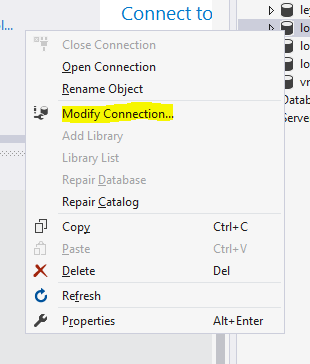
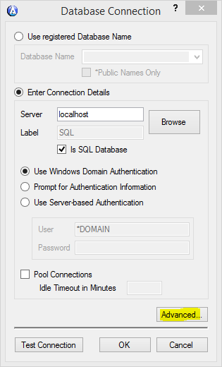
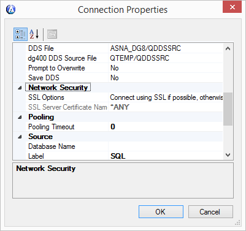
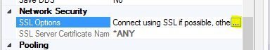
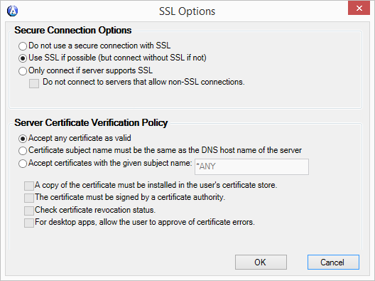

<table>
                    <tr>
                        <td>
                            
                                [
                                    SSL for ASNA
                                    DataGate &#174; Reference Manual
                                ](Welcome.html)
                            
                        </td>
                    </tr>
</table>

# DataGate SSL Deployment: DataGate Client

---

## DataGate Client
To successfully connect a DataGate client program to DataGate server using SSL features, you should also review your client connection properties. To do this, you will need to access the connection properties in DataGate Studio, or another program that utilizes the DataGate Source Profile Control, such as DataGate Monitor. In DataGate Studio, you access a connection's properties by right-clicking the connection or database name in DataGate Explorer, and selecting Modify Connection. 

This will bring up the Source Profile Control, which will look something like this. The SSL connection options are accessible on the Connection Properties page, which you access by clicking the "Advanced..." button. 

The Connection Properties page contains two new properties in DataGate V15, SSL Options and SSL Server Certificate Name, in the Network Security category, as shown below. 

You can configure both properties by clicking the ellipsis-notation button in the SSL Options value cell, as highlighted below. This button appears when you click anywhere in the value cell, to the immediate right of the "SSL Options" cell in the grid. 

Clicking the ellipsis brings up a custom editor to more easily set the various client options. 

Similar to the DataGate Service configuration editor, the top half of the client options editor details options for connecting to SSL-enabled server with encryption, and the lower half provides options for verifying the authenticity of an SSL-enabled server's identity. As shown above, the default values for all new DataGate client connections offer a good compromise for encrypted communication and ease of maintenance. 

The Server Connection Options group basically offer four different modes of connecting: 1) clear-text connections (no SSL), 2) either clear-text or encrypted SSL, 3) SSL only, and 4) SSL only, and only if the server does not offer non-SSL connections. 

Server Certificate Verification Policy group basically configures the way the client will verify an SSL certificate sent from the server (and thus, the server's identity). By default, the "Accept any" option only verifies that the certificate is cryptographically valid for bulk-encryption operations, as is required by DataGate. The other options provide means to verify the certificate's subject name is valid. You may choose to accept certificates that are named using the network Domain Name System's hostname for the server. This option helps to identify the server using the network DNS service. The drawback to this is that the server must be configured to use a certificate that has been generated with the current DNS name of the server. Otherwise, you may specify that the server's certificate have a particular subject name that you identify in the provided text input box. 

Other options allow further checks on the incoming server certificate. Having a copy of the server's certificate (minus the private key) installed in the user's certificate store is a good way to ensure due diligence by the network administrator's security plan. Of course, the best way to validate a server's certificate is to verify that it has been signed by a certificate authority (CA). Selecting this option causes the client to trace the certificates that have signed the server's certificate, and ensure that the signing certificate is installed in the client's certificate store as a well-known, trusted certificate authority . More information about obtaining, installing, and using a CA-signed certificate for SSL is abundant for the Microsoft Server products. Below are a few resources to review. Note that SSL has been traditionally used for Web Server security, and hence most of these documents are centric to that activity. However, the concepts and tools are basically the same for DataGate Server as they are for MS Internet Information Server (IIS). In fact, in many cases you may be able to use the same certificate for both IIS and DataGate server. 

<a href="https://msdn.microsoft.com/en-us/library/bb727098.aspx">Managing Microsoft Certificate Services and SSL</a>

<a href="https://technet.microsoft.com/en-us/library/cc731256(v=ws.10).aspx">Implementing and Administering Certificate Templates</a>

<a href="https://technet.microsoft.com/en-us/library/hh212810(v=sc.12).aspx">Authentication and Data Encryption for Windows Computers</a>

### DataGate Client and SQL Server Bulk Copy Considerations
DataGate offers a special feature for copying large amounts of data to a SQL Server database accessed by DataGate for SQL Server, which improves efficiency through bypassing the normal DSS/OLEDB interface. Basically, when a DataGate client program opens a file (that is, a SQL table/view) for write-cache access, and specifies a "blocking factor" in the file's open attributes, a connection is made through the SQL Server .NET data provider to take advantage of its "bulk copy" feature, which offers better throughput. Since this connection is completely independent of any DataGate connection, the options for enabling SSL transport for that connection are constrained by the SSL options offered by the SQL Server .NET provider, and the SQL Server Native Connection interface. This section details how DataGate connection options are used to set the SQL Server .NET provider options for this special case. 

Currently the SQL Server .NET data provider does not provide an option for determining the SSL configuration of the server, and handles most server certificate authentication internally. So some DataGate SSL options do not apply, for example, the option to accept only a server certificate with a certain name. In some cases, depending on SQL Server configuration, connections are always encrypted and authenticated, regardless of the connection options specified by the client. 

DataGate handles these issues by mapping the relevant DataGate client SSL options into the SSL options available to SQL Server .NET connections, and ignoring non-relevant or non-functional options. Note that because of these mappings, it is possible to configure a connection that works properly for connecting to DSS, but fails when connecting for bulk copy. There are two SQL Server .NET options for configuring a secure (SSL) connection. 

1. **Encrypt.**   This boolean value specifies whether the client will
                                request an encrypted (via SSL) data connection to the server.  The default value is
                                false, however as noted above, SQL Server settings may override this and connections
                                can be encrypted anyway.  The default value (false) may also be overridden by SQL
                                Server Configuration Manager.
2. **Trust Server Certificate.**   Another boolean value specifying whether
                                the server's authentication will be challenged based on the content of its certificate.
                                If set to true, no certificate verification occurs.  The default value is false, although
                                that can be overridden by SQL Server Configuration Manager.  If false, the server's
                                certificate must have a common name (CN) set to the fully-qualified domain name of
                                the server, and the certificate must be signed by, or registered as, a certificate
                                authority certificate.  Depending on SQL Server version and other settings, the
                                certificate may be subject to other qualifications when this value is false.

The following tables summarize the mapping of DataGate SSL options into SQL Server .NET provider options. Note that these mappings apply only to SQL bulk-copy connections created by DataGate: 
<table border="1">
                                <tr><td bgcolor="66CBEE" align="center"> **DataGate Client Connection Options<strong>** </strong></td><td bgcolor="66CBEE" align="center"> **Encrypt Value** </td></tr>
                                <tr><td>Request no SSL (or no SSL connection option specified).</td><td>Default</td></tr>
                                <tr><td>Request SSL but connect clear if not available.</td><td>True</td></tr>
                                <tr><td>Require SSL connection.</td><td>True</td></tr>
</table>
                             
                             
<table border="1">
                                <tr><td bgcolor="66CBEE" align="center"> **DataGate Client Certificate Verification Options** </td><td bgcolor="66CBEE" align="center"> **Trust Server Certificate Value** </td></tr>
                                <tr>
                                    <td>(No verification option specified).</td>
                                    <td>
                                        True, but only if Encrypt=True; otherwise Default.
                                    </td>
                                </tr>
                                <tr><td>Server Certificate must be signed by Certificate Authority.</td><td>Default</td></tr>
                                <tr><td>Server Certificate must have name of DNS hostname of server.</td><td>Default</td></tr>
                                <tr>
                                    <td>Server Certificate must have a specific name.</td>
                                    <td>
                                        True if Encrypt=True; otherwise Default.  Functionality not supported by SQL Server.
                                    </td>
                                </tr>
                                <tr>
                                    <td>Server Certificate must be installed in the local user's certificate store.</td>
                                    <td>
                                        True if Encrypt=True;
                                        otherwise Default.  Functionality not supported by SQL Server.
                                    </td>
                                </tr>
                                <tr>
                                    <td>Do not connect to the server if it allows non-encrypted connections.</td>
                                    <td>
                                        True if Encrypt=True;
                                        otherwise Default.  Functionality not supported by SQL Server.
                                    </td>
                                </tr>
                                <tr>
                                    <td>Prompt if certificate is found to be invalid.</td>
                                    <td>
                                        True if Encrypt=True;
                                        otherwise Default.  Functionality not supported by SQL Server.
                                    </td>
                                </tr>
</table>

For more information on how SSL encryption and server authentication operate in SQL Server, please consult these articles: 

- <a href="https://support.microsoft.com/en-us/kb/316898">How to enable SSL encryption for an instance of SQL Server by using Microsoft Management Console</a>
- <a href="https://msdn.microsoft.com/en-us/library/ms189067.aspx">Encrypting Connections to SQL Server</a>
- <a href="https://msdn.microsoft.com/en-us/library/ms131691.aspx">Using Encryption Without Validation</a>
- <a href="https://blogs.msdn.microsoft.com/dataaccess/2005/08/05/ssl-in-sql-server-2005-il-sung-lee/">SSL in SQL Server</a>

