<table>
			    <tr>
			      <td>
				   [SSL for ASNA 
				   DataGate &#174; Reference Manual
				   ](Welcome.html)</td>
			    </tr>
</table>

# DataGate SSL Deployment: DataGate for IBM i

---

## DataGate for IBM i
SSL support for the IBM i includes facilities for certificate stores and current TLS protocols. Note that there are several operating system software prerequisites for using these facilities. Please consult with your IBM i partner/retailer for more information about what OS/400 options are required for Digital Certificate Manager and SSL facilities.

DataGate for IBM i uses these facilities to functionally provide the same three options for securing connections as DataGate for Windows server:

1. No authentication/encryption
2. TLS authentication/encryption or no authentication/encryption
3. Only TLS authentication/encryption

The option is configured by the value of a <code>*DTAARA</code> object contained in the DataGate/400 installation library. The <code> *DTAARA</code> named "SSLLEVEL", of data type <code>*DEC</code>, can take one of the following values to configure how new connections will be made.
<table border="1">
	<tr><td bgcolor="66CBEE" align="center"> **Decimal Value** </td>
		<td bgcolor="66CBEE" align="center"> **New Connection Option** </td></tr>
	<tr><td>0</td><td>No SSL</td></tr>
	<tr><td>1</td><td>Best available (SSL or not, depending on the client's request).</td></tr>
	<tr><td>2</td><td>SSL Only</td></tr>
</table>

Note that if the <code>SSLLEVEL</code> data area is not found in the installation library, DataGate for IBM i will **NOT** make new connections, secure or otherwise. The default value of <code>SSLLEVEL</code> as initially installed is 1, "best available". This is also the default value if a value other than what is shown in the table is read from <code>SSLLEVEL</code>.

### Certificates and DataGate for IBM i
Unlike the Windows platform, the certificate stores on the IBM i are simple stream files which reside in the IFS file system. A single, central certificate store, similar to the Local Machine store on Windows, is available for use by system servers and application servers (like DataGate for IBM i). However, access to this store is available to only a single user profile which the server runs under. DataGate for IBM i provides a run-time environment similar to that of an interactive, green-screen job, which runs under an arbitrary, typically unpriveledged, user profile. Unfortunately, such users cannot access the system certificate store on the IBM i directly. 

To preserve the DataGate/400 user experience, DataGate for IBM i can be configured to use a different certificate store than the system store. Other certificate stores can be configured like any other on the IBM i, with the Digital Certificate Manager tool (also known as DCM). The DataGate for IBM i installed default certificate store is contained in the stream files <code>'/ASNA/DataGate/CertStore.kdb'</code> and <code>'/ASNA/DataGate/CertStore.rdb'</code>. Within these files is a certificate labelled <code>"DataGate/400"</code>, which is the certificate that DataGate/400 is initially configured to use to create SSL connections. All DataGate for IBM i users must have "read" access to the certificate store files, and the installed default certificate store files are configured this way. Note though, that the certificate store is secured by a password. To preserve the security of the certificate store and the private keys it contains, the password should be secret.

To enable the system administrator to configure these parameters (certificate store file, certificate label, and certificate store file password), DataGate for IBM i provides a set of three more <code>*DTAARA</code> objects of type <code>*CHAR</code>, residing in the installation library. The following table shows the data area names and a description of their contents.
<table border="1">
	<tr><td bgcolor="66CBEE" align="center"> **Data area object name** </td>
		<td bgcolor="66CBEE" align="center"> **Description of Contents** </td>
		<td bgcolor="66CBEE" align="center"> **Example Value** </td></tr>
	<tr><td><code>SSLCERTDB</code></td><td>The path of the .KDB file of the certificate store 
	used by DataGate/400. Note that the accompanying .RDB file should reside 
	in the same directory.</td><td>/ASNA/DataGate/CertStore.kdb</td></tr>
	<tr><td><code>SSLLABEL</code></td><td>The label of the certificate contained 
	in the certificate store, that DataGate/400 uses to identify the 
	certificate for SSL connections.</td><td>DataGate/400</td></tr>
	<tr><td><code>SSLPASSWD</code></td><td>The password used to access the contents of the 
	certificate store. To maintain security, this should  
	be a strong password and remain a secret to users. Passwords are
	assigned to a certificate store with DCM. Note that the tool imposes certain 
	restrictions on the password value. Any trailing blank characters in the value 
	are ignored.</td><td>ADz5g3bnkX3YYFmxaN6s</td></tr>
</table>

The <code>SSLPASSWD</code> data area is particularly sensitive, since it allows access to the security store, and potentially the private key used to encrypt data transmissions. This data area should have <code>*PUBLIC/*EXCLUDE</code> permission, but also note that the logon-disabled <code>DG8SVCPRF</code> user profile must have access to its contents (<code>DG8SVCPRF/*USE</code>). <code>DG8SVCPRF</code> is the user profile installed to run the "listener" service jobs that wait for and authenticate new connections. Since they initialize SSL connections, they must be able to use the secret password to access the certificate assigned to DataGate for IBM i.

#### Configuring A New Certificate Store and Certificate
The default <code>*DTAARA</code> objects and certificate store files installed with DataGate for IBM i are provided to allow a system administrator an "out of the box" example experience in terms of secure network communication with DataGate. However, since the same objects are provided in all distributions of DataGate for IBM i, it is a fallacy to believe your DataGate configuration is highly secure as-is after an initial install. A thoughtful security plan will include the creation of your own certificate store, password, and server certificate. There are several excellent documents available from IBM for achieving this, but the following walkthrough may be useful for getting started.

First, you should become familiar with the IBM i Digital Certificate Manager ] web browser, as shown. You must consult an IBM reference for the correct URL to use to access DCM on your particular release of OS/400.

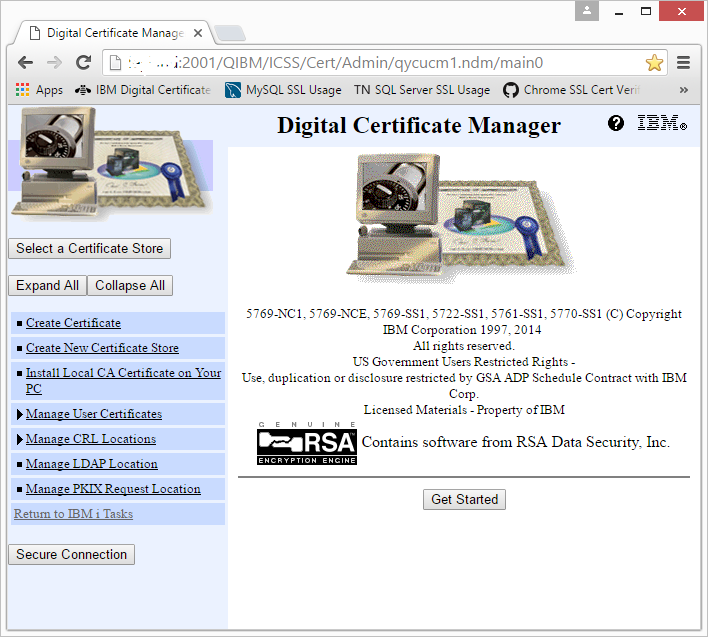

To get started, click the 'Create New Certificate Store' link. This will prompt you to decide what kind of certificate store you would like to create. Select 'Other System Certificate Store' and click the continue button, as shown below.

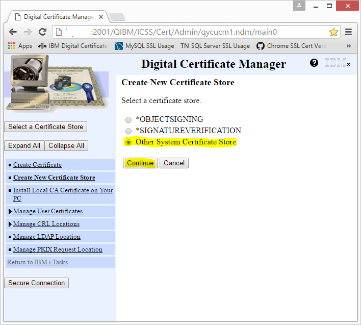

The next page asks if you want to create a certificate in the new store. Select 'Yes' and Continue.

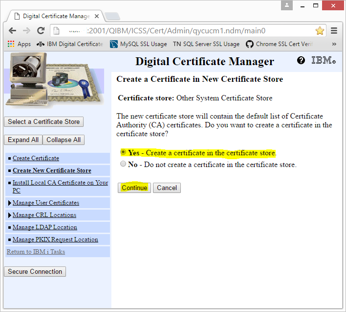

The next page lets you decide how the certificate should be signed. Certificate signing is a topic beyond the scope of this document, but basically it is a way to ensure the authenticity of your certificate. To simplify things in this introductory walkthrough, select 'Local Certificate Authority' and click 'Continue', as below.

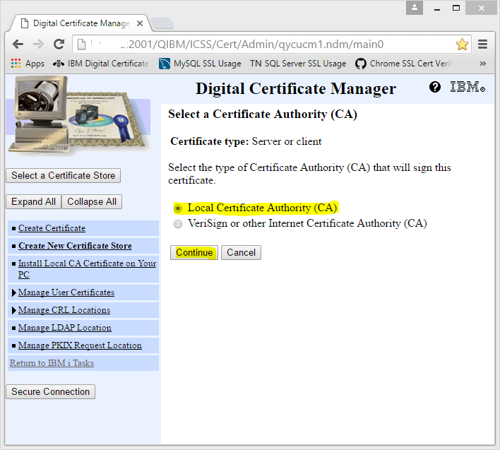

The next page lets you choose all the interesting details about your new certificate, the certificate store where it will reside, and a password to access it. In choosing a 'Key Algorithm' and 'Key Size', you should consider whether or not your client Windows machines will be able to use a certificate with those parameters, and how you wish to balance security with data throughput. In most cases, the defaults are fine (RSA, 2048 bits).

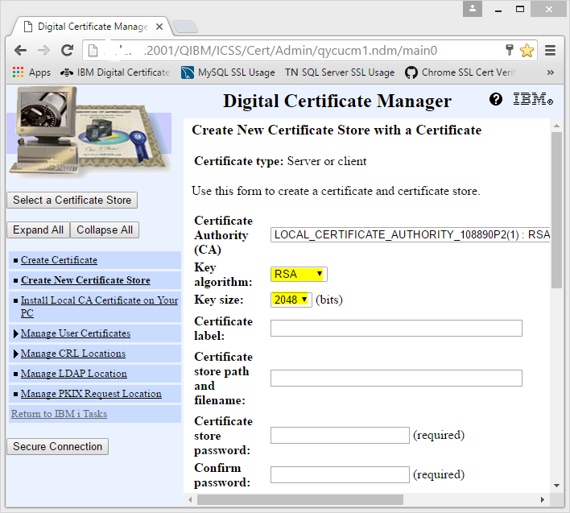

On the same page, next decide on a name for your new certificate. This label will be the one you specify in the <code>SSLLABEL *DTAARA</code> in the DataGate/400 configuration. Any arbitrary name will do, but make sure you only use characters available in your local system's default CCSID.

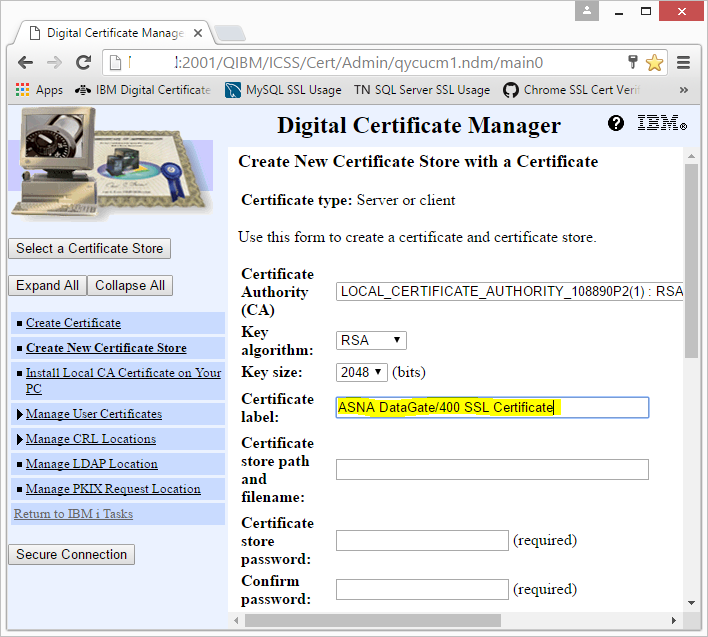

Next you will enter the password that will secure the contents of the certificate store, including the new certificate. The value specified for the password must be placed in the SSLPASSWD *DTAARA object in the DataGate/400 installation library, and should be know only to you. Also, don't worry if you specify invalid characters here; DCM will validate the password and prompt you to pick another password if necessary. Currently the valid characters for certificate store passwords are only upper and lower case alphanumeric characters. The more complex the password, the better security for your certificate store.

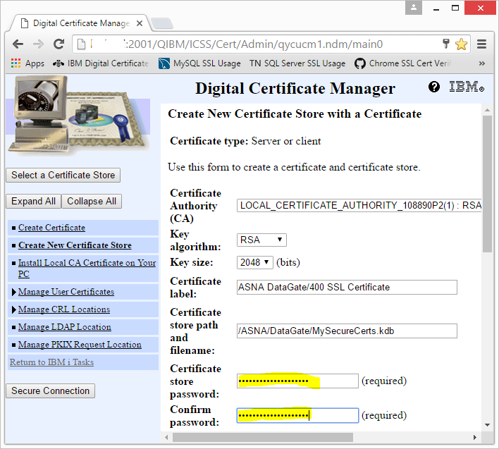

Next, scroll down to enter other certificate details as you wish. You may want to consider the value for the 'Common name' field, as it can be used by DataGate client programs to help verify the authenticity of your server with the "Accept certificates with subject name" option (as detailed in the DataGate Client section below). All other fields are arbitrary, as far as DataGate for IBM i is concerned. The 'Subject Alternative Name' fields are not used by DataGate, though other applications that use this certificate may require these.

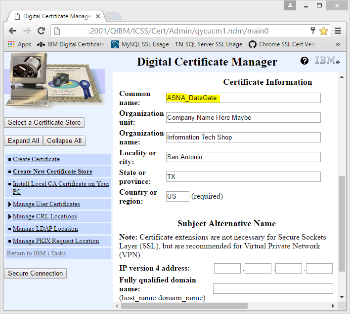

The next step is to create the certificate store and your certificate. Scroll to the bottom of the page and click the 'Continue' button. If all the entered fields are valid according to DCM, then you should see a page similar to the one below. This page, once again, shows the certificate store path (copy this to the <code>SSLCERTDB *DTAARA</code>) and the certificate label (copy this to the <code>SSLLABEL *DTAARA</code>). 

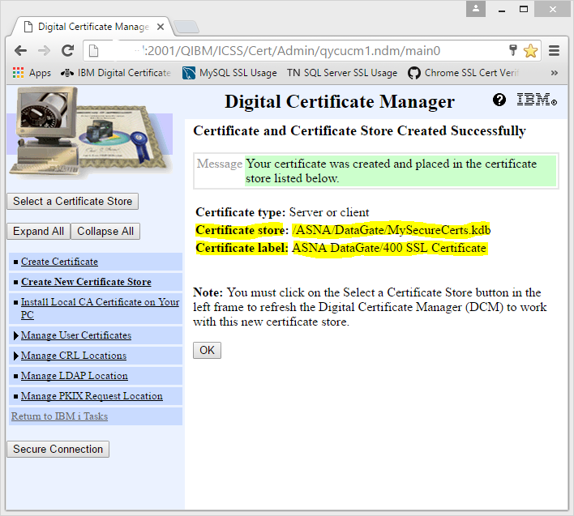

The following are commands you would use to set the data area objects to use the certificate just created above in your DataGate/400 installation (assume it was installed to the DG8 library). Make sure you are running these under a suitably privileged user profile.
<pre>CHGDTAARA DTAARA(DG8/SSLCERTDB *ALL) VALUE('/ASNA/DataGate/MySecureCerts.kdb')
CHGDTAARA DTAARA(DG8/SSLLABEL *ALL) VALUE('ASNA DataGate/400 SSL Certificate')
CHGDTAARA DTAARA(DG8/SSLPASSWD *ALL) VALUE('ADz5g3bnkX3YYFmxaN6s')
</pre>

*Please* choose a different password; this was given only as an example. 

#### Permissions on Certificate and Configuration Objects
There are still a few critical steps that must be performed for DataGate/400 to use the correct configuration and for your certificate store to be secure.

First, make sure that the certificate store stream file is read-only accessible to all users. There is more than one way to do this (e.g., QSH), but this CL command will set the store file's attributes correctly:
<pre> CHGAUT OBJ('/ASNA/DataGate/MySecureCerts.kdb') USER(*PUBLIC) DTAAUT(*R)</pre>

You can verify the *R (read-only) attribute of the file with this command:
<pre>DSPAUT OBJ('/ASNA/DataGate/MySecureCerts.kdb') </pre>

This should display a screen similar to the one below, displaying the correct <code>*RW</code> (read/write) permission for <code>QSYS</code> and <code>*R</code> (read-only) for <code>*PUBLIC</code>.

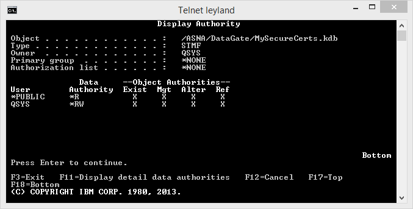

Secondly, make sure that the <code>SSLPASSWD</code> data area is protected from unauthorized access. Recall that this data area should only be accessible by the DataGate/400 user profile, <code>DG8SVCPRF</code>. You should make this change after ha ving set the value of the data area with the certificate store password, as detailed above. Use these commands, running under a user profile with <code>*ALLOBJ</code> authority, to ensure that this is the case:
<pre>GRTOBJAUT OBJ(DG8/SSLPASSWD) OBJTYPE(*DTAARA) USER(DG8SVCPRF) AUT(*USE)

RVKOBJAUT OBJ(DG8/SSLPASSWD) OBJTYPE(*DTAARA) USER(*PUBLIC) AUT(*ALL)</pre>

After running these commands, you can verify the authorities are correct with this command:
<pre>DSPOBJAUT OBJ(DG8/SSLPASSWD) OBJTYPE(*DTAARA)</pre>

The display should resemble the screen below, allowing use only by <code>DG8SVCPRF</code>.

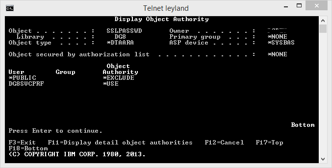
