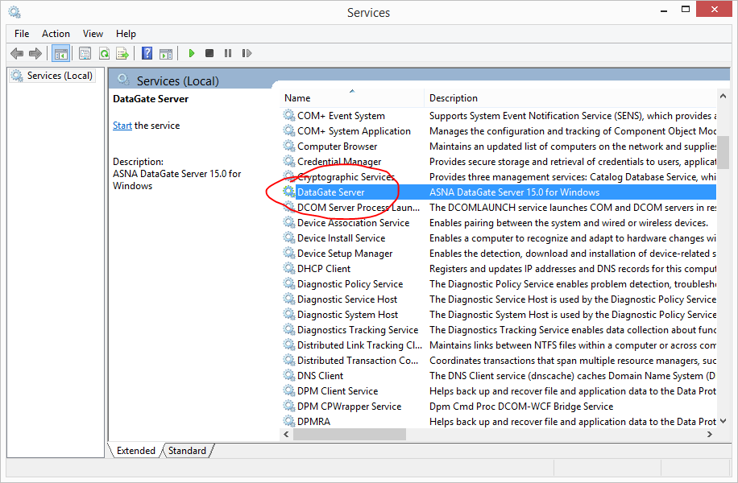
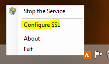
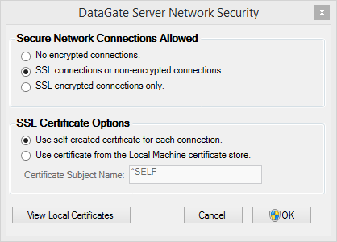

<table>
                    <tr>
                        <td>
                            
                                [
                                    SSL for ASNA
                                    DataGate &#174; Reference Manual
                                ](Welcome.html)
                            
                        </td>
                    </tr>
</table>

# DataGate SSL Deployment: Windows Servers

---

## Windows-based DataGate Servers
DataGate for Windows and Desktops and DSS both run in the DataGate Service, a Windows service found in the Windows Services console as shown. 

In DataGate V15, a new Notification Area Icon for the Windows Taskbar was introduced to allow desktop users to monitor, control, and configure the DataGate Service running on their computers. 

## SSL and DataGate
You can use this icon to easily access the SSL server configuration options program. Right-click on the icon to display a context menu. Click on the selection highlighted below: 

Selecting "Configure SSL" will bring up the DataGate Server Network Security tool. This is a simple dialog window that allows you to configure how SSL connections will be offered to connecting DataGate clients. The figure shown below is what the window will typically look like after a new DataGate installation, with the default configuration chosen. 

The top half of the window allows you to select the connection types allowed by the service. By default, both SSL and non-SSL connections are accepted by the server. This means that new V15+ DataGate clients that support SSL connections can connect to this server. Also, older DataGate clients that don't support SSL, or V15 clients that are configured to connect without SSL can connect, because both types of connections are allowed by this configuration. 

The "No encrypted connections" option specifies that no SSL connections will be offered by the server, whether or not the client requests one. Typically, the client requesting an SSL-enabled connection with this server configured with this option will either refuse to connect, or connect with the down-level, non-SSL connection. 

The "SSL encrypted connections only" option specifies that the server will offer only SSL-enabled connections. Thus, a client requesting a non-encrypted connection will be refused by the server. 

The lower half of the window specifies the certificate type to be used by SSL-enabled connections. Note that this area is disabled (greyed-out) if the "No encrypted connections" option is selected. The default as shown above is to use a self-signed certificate created by DataGate. This option causes the DataGate service to create a self-signed certificate upon the first requested SSL connection, to be used to negotiate all SSL sessions while the service is running. Alternatively, you can select a certificate from the local machine's certificate store by name. This is potentially a more secure option, because you can specify a certificate that may have been signed by a certificate authority, or have other attributes specific to your environment. 

This window includes a shortcut button you can use to launch the Local Machine certificate store console. This will allow you to import or browse the certificates which you may want to specify the subject name of in the Certificate Subject Name text box. 

After completing this configuration, you can click the OK button to save your changes. Note that you must have administrator rights, or specify an administrator logon, to save changes. Also, changes made in this window do not take effect until the DataGate Service is restarted. The program will ask you to restart the service, another administrator-level task, after OK is clicked. 
