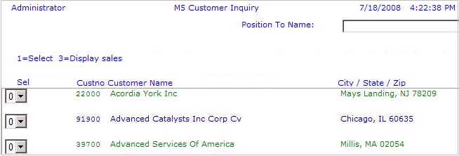

Gets or sets a value for the field that when selected, is treated the same as if the user had entered this value and pressed &lt;enter&gt;.

#### Syntax
<pre class="syntax"> **BegProp SubmitValue Access(*Overrides) Type(*String)
   BegGet;  BegSet** </pre>

#### Property Values
String containing a value for the field that is the same as if the user had entered this value and pressed &lt;enter&gt;.

#### Remarks
When **SubmitValue** is defined, the field will be displayed as output only and clicking on it will be the same as if the user had typed in the value of **SubmitValue** . The text to be displayed is set on [ Text](amfDdsDataFieldClassTextProperty.html) property. [ AutoPostBackKey](amfDdsCharFieldClassAutoPostBackKeyProperty.html) property simulates a key press after the field has been clicked on. Default key pressed is 'Enter'.
<!-- start -->

#### Example
Notice in the partial sample display below, the ***Sel*** field where the user can pick from the drop down value of 0, 1, or 3 to either select the customer record or display the customer sales.

 

The underlying aspx source shows the definition for the drop down box as follows:
<pre class="example">&lt;mdf:DdsDecField id="SFL1_SFSEL" runat= "server"
        CssClass="DdsCharField"
        Length="2"          
        Decimals="0"
        style="POSITION: absolute; LEFT: 2px; TOP: 0px;"
        Alias="SFSEL"
        VisibleCondition="!( 60 )"
        Usage="Both"
        VirtualRowCol="8,4"
        Protect="60"
        EditCode="Z"
        ValuesStyle="DropdownValues"
        Values="0 1 3"&gt; </pre>

To affectively use this property, we want to replace the Sel field to allow the user to select a 'text' value for (one of) the two options available. There are several changes that need to be made. The **CssClass** property needs to be changed to an output only field (DdsDecField_Link). The **Text** property value is set to "Select". The **ValuesStyle** property is replaced with **SubmitValue** with a value of "1", which was the value for selecting the customer. **AutoPostBackKey** property is added with the "Enter" key.

When the changes are completed, the aspx for ** *Sel* ** will look like the following:
<pre class="example">&lt;mdf:DdsDecField id="SFL1_SFSEL" runat= "server"
        CssClass="DdsCharField_link"
        Length="2"          
        Decimals="0"
        style="POSITION: absolute; LEFT: 2px; TOP: 0px;"
        Alias="SFSEL"
        VisibleCondition="!( 60 )"
        Usage="Both"
        VirtualRowCol="8,4"
        Protect="60"
        EditCode="Z"
 **Text="Select"
        SubmitValue="1"
        AutoPostBackKey="Enter"** &gt; </pre>

This change only provides one of the two previous options, so a second field would need to be added to allow the same ease of selection for the Display Sales function. Once the field was added, it would provide a solution something similar to that shown below. The user can click on either Select or Sales where before they selected 1 or 3 from the drop down box.

 

#### Requirements
**Namespace:** [ASNA.Monarch.WebDspF](amfWebDspFNamespace.html)

**Assembly:** ASNA.Monarch.WebDspF.DLL

**Platforms:** Windows Server 2012, Windows Server 2012 R2, Windows Server 2016, Windows 7, Windows 8 Pro, Windows 10 Pro

#### See Also
[ DdsCharField Class](amfDdsCharFieldClass.html)   [ DdsCharField Class Members](amfDdsCharFieldClassMembers.html)   [ ASNA.Monarch.WebDspF Namespace](amfWebDspFNamespace.html) 
