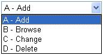

Gets or sets a value that determines the control style used to input data for fields with a set of entries in the [ Values](amfDdsDataFieldClassValuesProperty.html) property.

#### Syntax
<pre class="prettyprint"> **BegProp ValuesStyle Access(*Public ) Type(ASNA.Monarch.WebDspF.ValueStyles)
   BegGet;  BegSet** </pre>

#### Property Values
[ ASNA.Monarch.WebDspF.ValueStyles](amfValuesStyleEnumeration.html). One of the valid enumeration values. The default is **Textbox.** 

#### Remarks
The default style for **ValuesStyle** is **Textbox.** However, if there are entries for the **Values** property, then you will need to select one of the 'Dropdown' values for those entries to display. To set the property, click on the arrow to the right of the property window and choose one of the options in the drop-down box.

Choose **DropdownBoth** to display a drop-down box containing the entries for the **Values** AND [ ValuesText](amfDdsDataFieldClassValuesTextProperty.html) properties. For example, entries of **A B C D** in the **Values** property, AND entries of **Add Browse Change Delete** in the **ValuesText** property will display:

 

Choose **DropdownText** to display a drop-down box containing the entries for the **ValuesText** property. For example, entries of **Add Browse Change Delete** in the **ValuesText** property will display:

 

Choose **DropdownValues** to display a drop-down box containing the entries for the **Values** property. For example, entries of **A B C D** in the **Values** property will display:

 

For the user to see the entries in the **Values** property, the **ValuesStyle** property must be set to either **DropdownValues** or **DropdownBoth** (also displays **ValuesText** property).

For the user to see the entries in the **ValuesText** property, the **ValuesStyle** property must be set to either **DropdownText** or **DropdownBoth** (also displays **Values** property).

***Note:** If there are no entries in the **Values** property, then regardless if there are entries for the **ValuesStyle** and **ValuesText** properties,* they will be disregarded and the field will display as a **TextBox** .

#### Requirements
**Namespace:** [ASNA.Monarch.WebDspF](amfWebDspFNamespace.html)

**Assembly:** ASNA.Monarch.WebDspF.DLL

**Platforms:** Windows Server 2012, Windows Server 2012 R2, Windows Server 2016, Windows 7, Windows 8 Pro, Windows 10 Pro

#### See Also
[DdsDataField Class](amfDdsDataFieldClass.html)   [ DdsDataField Class Members](amfDdsDataFieldClassMembers.html)   [ Derived Classes](amfDdsDataFieldDerivedClasses.html)  [ ASNA.Monarch.WebDspF Namespace](amfWebDspFNamespace.html) [ValuesText Property](amfDdsDataFieldClassValuesTextProperty.html) [Values Property](amfDdsDataFieldClassValuesProperty.html) [ ASNA.Monarch.WebDspF.ValueStyles Enumeration](amfValuesStyleEnumeration.html)
