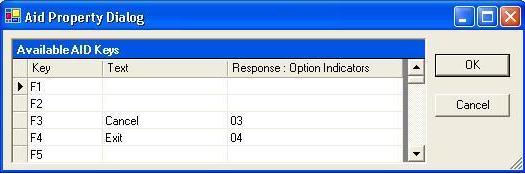

Gets or sets which keys the user can press, the message to be displayed, and the response indicators to turn on. No input data is transmitted from the Browser.

#### Syntax
<pre class="prettyprint"> **BegProp AttnKeys Access(*Public) Type(ASNA.Monarch.WebDspF.AidProperty)
   BegGet;  BegSet;** </pre>

#### Property Values
**ASNA.Monarch.WebDspF.AidProperty** containing the attention key settings in a semicolon( **;** ) separated list.

#### Remarks
The **AttnKeys** property contains all attention key settings in a semicolon( **;** ) separated list of function key, 'text', and conditional property (response **:** option indicators).

For example: **F3 'Cancel' 03;F4 'Exit' 04;** 

This property is mainly used to control processing within the application to control flow within the form since NO input data is transmitted from the browser. Use the [ FuncKeys](amfDdsFileClassFuncKeysProperty.html) property to specify function keys that transfer input to the Browser.

To set this property at design-time, click on the right of the **AttnKeys** property and the **Aid Property Dialog** will display. Enter the Text and resulting option indicators in the row corresponding to the key to apply to as shown below.

 

#### Requirements
**Namespace:** [ASNA.Monarch.WebDspF](amfWebDspFNamespace.html)

**Assembly:** ASNA.Monarch.WebDspF.DLL

**Platforms:** Windows Server 2012, Windows Server 2012 R2, Windows Server 2016, Windows 7, Windows 8 Pro, Windows 10 Pro

#### See Also
[DdsFile Class](amfDdsFileClass.html)   [DdsFile Class Members](amfDdsFileClassMembers.html)   [ DdsFile.FuncKeys Property](amfDdsFileClassFuncKeysProperty.html)   [ ASNA.Monarch.WebDspF Namespace](amfWebDspFNamespace.html)   [Overview of Aid Keys](amfconOverviewofAidKeys.html) 
