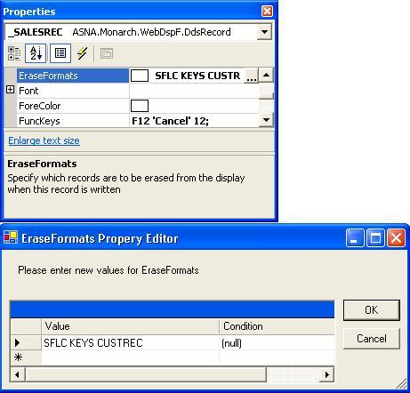

Gets or creates an instance of **ASNA.Monarch.WebDspF.EraseProperty** specifying which record formats are to be erased from the display when this record is written.

#### Syntax
<pre class="prettyprint"> **BegProp EraseFormats Access(*Public) Type(ASNA.Monarch.WebDspF.EraseProperty)
   BegGet;  BegSet** </pre>

#### Property Values
**ASNA.Monarch.WebDspF.EraseProperty** object containing the record format ID's to be erased from the display.

#### Remarks
The **EraseFormats** property allows you to specify which record formats you want to be erased from the display when this record is written. The default is ***ALL** , which indicates to remove all records.

To set the **EraseFormats** property at design-time, click on the far right side of the **EraseFormats** property and the **EraseFormats Property Editor** will display as shown below. See [Conditional Properties Overview](amfconConditionalPropertiesOverview.html) and [ Monarch Web Control Indicator Expression Tester](amfMonarchWebControlIndicatorExpressionTester.html) for more information on setting the conditional indicators and testing your expressions.

 

#### Requirements
**Namespace:** [ASNA.Monarch.WebDspF](amfWebDspFNamespace.html)

**Assembly:** ASNA.Monarch.WebDspF.DLL

**Platforms:** Windows Server 2012, Windows Server 2012 R2, Windows Server 2016, Windows 7, Windows 8 Pro, Windows 10 Pro

#### See Also
[DdsRecord Class](amfDdsRecordClass.html)   [ DdsRecord Class Members](amfDdsRecordClassMembers.html)   [ ASNA.Monarch.WebDspF Namespace](amfWebDspFNamespace.html)   [ EraseProperty Class](amfErasePropertyClass.html)   [ Conditional Properties Overview](amfconConditionalPropertiesOverview.html)   [ Monarch Web Control Indicator Expression Tester](amfMonarchWebControlIndicatorExpressionTester.html) 
