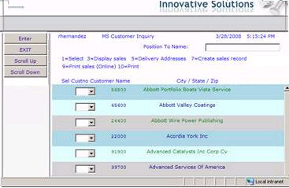

Gets or sets a string containing a space or comma separated list of css classes to use for alternating rows.

#### Syntax
<pre class="prettyprint"> **BegProp RowsCssClasses Access(*Public) Type(*String)
   BegGet;  BegSet** </pre>

#### Property Values
String. A space separated list of css classes to use for alternating rows.

#### Remarks
It takes a space or comma separated list of class names that will get applied to the rows in the order given.

In the example below three classes were added:

.One { background-color : LightBlue ;}

.Two { background-color : LightCyan ;}

.Three { background-color : LightGrey ;}

And the property was set to: One Two Three

&lt; mdf : DdsSubfile id ="_SFL1" … RowsCssClasses ="One Two Three"&gt; 

The subfile grid would appear as:

 

To set this property at design-time, click on the right of the **RowsCssClasses** property and enter a space-separated list of css classes to use for alternating rows.

#### Requirements
**Namespace:** [ASNA.Monarch.WebDspF](amfWebDspFNamespace.html)

**Assembly:** ASNA.Monarch.WebDspF.DLL

**Platforms:** Windows Server 2012, Windows Server 2012 R2, Windows Server 2016, Windows 7, Windows 8 Pro, Windows 10 Pro

#### See Also
[DdsSubfile Class](amfDdsSubfileClass.html)   [ DdsSubfile Class Members](amfDdsSubfileClassMembers.html)   [ ASNA.Monarch.WebDspF Namespace](amfWebDspFNamespace.html) 
