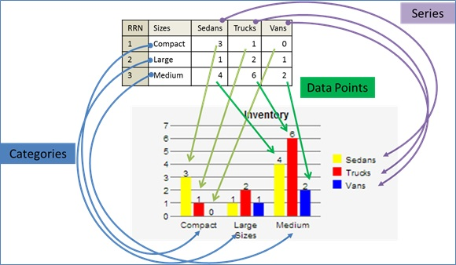
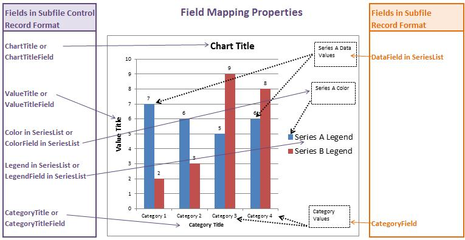
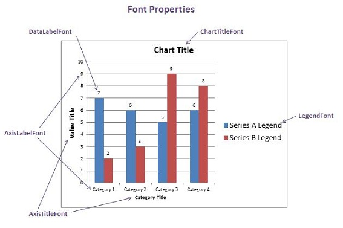

<table>
			    <tr>
			      <td>
				   ASNA Monarch&#174; Framework 10.0</td>
			    </tr>
</table>

# Chart Controls

### What is a DdsChart?
ASNA Mobile support includes a control that allows users to generate charts from data pulled from the IBM i. The control can generate charts in column (the default), bar, line, or pie formats.

**Applicability:** These controls can be used in Monarch, Wings, and Mobile RPG pages/apps.

### Mechanics of a DdsChart
The chart is populated with **series** of data selected from subfiles. Each series represents a distinct data set, such as sales or inventory of a specific product. You can define as many series as you wish, but more than five may become difficult to distinguish and use a great deal of screen-space. Each series is described in a Series control, with its onscreen attributes controlled by Legend and Color properties.

The Legend property sets the name associated with that series of data, and the Color property sets the color that will be used to represent it in the chart. A key will automatically be created from the information provided in the subfile control for each series. A bar, column, line-point, or pie-slice will be generated for each data point in each series.

Individual Series can be configured with the [Series Collection Editor](amfUnderSeriesList.html).

The charts are highly configurable, with colors, fonts, sizes and labels all easily modified to match the style of the mobile site and needs of the designer. All of these changes are enabled by the [Chart Control](amfDdsChartClass.html), a part of the Monarch Framework. The chart's appearance (including size, layout, and font options) is defined by numerous properties built into the framework.

<table class="TaskTable" border="1" cellspacing="0" cellpadding="0" width="637">
   						 <tbody>

							 <tr>
           						 <td valign="top" align="center" style="width: 117px">
 **Property** 
								</td>
								<td valign="top" style="width: 468px" align="center">
 **Notes** 
								</td>
							</tr>
								  						  <tr>
            <td colspan="2" valign="top">

**Appearance** 
</td>
</tr>
					<tr><td><code> **[EditCode](amfDdsChartClassEditCodeProperty.html)** </code></td>
						<td>Sets a string containing an edit code to punctuate numeric fields according to the standard RPG edit code rules.</td></tr>
					<tr><td><code> **[EditWord](amfDdsChartClassEditWordProperty.html)** </code></td>
						<td>Sets a string containing an edit word to punctuate numeric fields 
						according to the standard RPG rules for edit words.</td></tr>
										<tr><td><code> **[CategoryTitle](amfDdsChartClassCategoryTitleProperty.html)** </code></td>
						<td>The title of the category (the x-axis on a Column or Line chart, the y-axis on a Bar chart). The appearance of the title is set by the Axis Title properties.</td></tr>
					<tr><td><code> **[ChartTitle](amfDdsChartClassChartTitleProperty.html)** </code></td>
						<td>The title of the chart. 
							Separate properties determine the 
							[color](amfDdsChartClassChartTitleFontColorProperty.html), 
							[size](amfDdsChartClassChartTitleFontSizeProperty.html), 
							[family](amfDdsChartClassChartTitleFontFamilyProperty.html) and 
							[style](amfDdsChartClassChartTitleFontStyleProperty.html) of the font.</td></tr>
										<tr><td><code> **[ValueTitle](amfDdsChartClassValueTitleProperty.html)** </code></td>
						<td>Sets the title for the value  (the y-axis on a Column or Line chart, or the
						y-axis on a Bar chart). The appearance of the title is set by the Axis Title properties.</td></tr>
		<tr>
            <td colspan="2" valign="top">

**Behavior** 
</td>
       </tr>		
					<tr><td><code> **[ChartType](amfDdsChartClassChartTypeProperty.html)** </code></td>
						<td>The type of chart to be presented (see the Chart Types section below).</td></tr>	
		<tr>
            <td colspan="2" valign="top">

**Data** 
</td>
       </tr>	
				<tr><td><code> **[SeriesList](amfDdsChartClassSeriesListProperty.html)** </code></td>
						<td>The SeriesList contains the collection of "series" that contain the data for the table. Clicking the link opens the [Series List Editor](amfUnderSeriesList.html).</td></tr>
				<tr><td><code> **[CategoryField](amfDdsChartClassCategoryFieldProperty.html)** </code> &amp;  

				<code> **[CategoryFieldLength](amfDdsChartClassCategoryFieldLengthProperty.html)** </code></td>
						<td>These properties define a character field whose runtime value provides data for a category. </td></tr>

					<tr><td><code> **[ClearIndicator](amfDdsChartClassClearIndicatorProperty.html)** </code></td>
						<td>Sets the number of the indicator used for clearing the subfile records.</td></tr>

					<tr><td><code> **[SelectDataField](amfDdsChartClassSelectDataFieldProperty.html)** </code></td>
						<td>Sets the action to be taken when a data field is selected.</td></tr>
					<tr><td><code> **[SelectDataKey](amfDdsChartClassSelectDataKeyProperty.html)** </code></td>
						<td>Sets the action to be taken when a data key is selected.</td></tr>
					<tr><td><code> **[SelectSeriesField](amfDdsChartClassSelectSeriesFieldProperty.html)** </code></td>
						<td>Sets the action to be taken when a series field is selected.</td></tr>
					<tr><td><code> **[SelectSeriesKey](amfDdsChartClassSelectSeriesKeyProperty.html)** </code></td>
						<td>Sets the action to be taken when a series key is selected.</td></tr>
					<tr><td><code> **[SubfileControlName](amfDdsChartClassSubfileControlNameProperty.html)** </code></td>
						<td>Defines the name of the subfile controller.</td></tr>
					<tr><td><code> **[SubfileName](amfDdsChartClassSubfileNameProperty.html)** </code></td>
						<td>Defines the name of the subfile Record format.</td></tr>

				</tbody>
</table>

#### Chart Types
The data behind a chart can be presented in any of the following ways, as determined by the <code>[ChartType](amfDdsChartClassChartTypeProperty.html)</code> property. The presentation of the chart doesn't affect the underlying data; the IBM i always sees exactly the same subfile. As an example of how the data is related to presentation, consider the following table:
<table align="center">
							<tr>
								<th>RRN</th><th>Sizes</th>
								<th style="width: 54px">Sedans</th><th>Trucks</th><th>Vans</th>
							</tr>
							<tr>
							<td>1</td><td>Compact</td><td style="width: 54px">3</td><td>1</td><td>0</td>
							</tr>
							<tr>
							<td>2</td><td>Large</td><td style="width: 54px">1</td><td>2</td><td>1</td>
							</tr>
							<tr>
							<td>3</td><td>Medium</td><td style="width: 54px">4</td><td>6</td><td>2</td>
							</tr>

</table>

The first column is the order of the series. The second represents the size category of the vehicles, while the remaining columns cover the number of vehicles of each type and size. 

**Column and Bar Charts** 

Column and bar charts function very similarly; the rotation of the axes is the only significant change. Both present each datapoint of as a bar of a color associated with the series that contains it. These are often the easiest charts to read on a phone, as the datapoints are usually quite visually distinct, and the labels are easier to pick out and read. 

Taking the above subfile and using it as the basis of a bar chart yields the following:

Each type of vehicle comprises a Series of data with 3 data points, as does the "sizes" column, and each datapoint is represented by a bar of the color tied to the series. Each rows of data in the subfile makes up a unique cluster of datapoints on the map, called a "datasegment." Things behave similarly if the data is presented as a column chart:

The series and datasegments remain the same; only the orientation of the chart is changed.

**Line Charts** 

Line charts provide a simple visual shorthand by linking datapoints over time (or another fixed variable). They can save some screen space by presenting a full datasegment on a single vertical axis, but may be more difficult to read depending on the size, closeness, and colors of the lines. When the lines cross, the series listed first will always display on top.

**Pie Charts** 

A pie chart, by contrast, uses only the first series, and varying shades of the color tied to the series. In this case it shows only the data for sedans:

Pie charts should be used with some care, as they can become difficult to read on a small screen if too many data points are included.

#### Chart Labels and Names

The Chart control has a number of integral labels that can be adjusted or omitted based on design needs, these include:
<table>
						<tr><td style="height: 25px"> **Chart Title** 
						</td><td style="height: 25px">The title of the chart. 
							Seperate properties determine the 
							[color](amfDdsChartClassChartTitleFontColorProperty.html), 
							[size](amfDdsChartClassChartTitleFontSizeProperty.html), 
							[family](amfDdsChartClassChartTitleFontFamilyProperty.html) and 
							[style](amfDdsChartClassChartTitleFontStyleProperty.html) of the font.</td></tr>
						<tr><td> **Category Title** 
						</td><td>The title of the category (the x-axis on a 
							Column or Line chart, the y-axis on a Bar chart). 
							The appearance of the title is set by the Axis Title 
							properties. </td></tr>
						<tr><td> **Axis Title** 
						</td><td>These describe the titles of the axes (Value 
							Title and Category Title). Some properties can set 
							the 
							[color](amfDdsChartClassAxisTitleFontColorProperty.html), 
							[size](amfDdsChartClassAxisTitleFontSizeProperty.html), 
							[family](amfDdsChartClassAxisTitleFontFamilyProperty.html) and 
							[style](amfDdsChartClassAxisTitleFontStyleProperty.html) of the font.</td></tr>
						<tr><td> **Axis Label** 
						</td><td>The numbering on 
							the axes. The 
							[color](amfDdsChartClassAxisLabelFontColorProperty.html), 
							[size](amfDdsChartClassAxisLabelFontSizeProperty.html), 
							[family](amfDdsChartClassAxisLabelFontFamilyProperty.html) and 
							[style](amfDdsChartClassAxisLabelFontStyleProperty.html) of 
							the font can all be set by the user.</td></tr>
						<tr><td> **Data Label** 
						</td><td>The numbering attached to each data point. 
							The 
							[color](amfDdsChartClassDataLabelFontColorProperty.html), 
							[size](amfDdsChartClassDataLabelFontSizeProperty.html),
							 [family](amfDdsChartClassDataLabelFontFamilyProperty.html) and 
							[style](amfDdsChartClassDataLabelFontStyleProperty.html) of the font can 
							all be set by properties, as can the 
							[position](amfDdsChartClassDataLabelPositionProperty.html) of the 
							labels.</td></tr>
						<tr><td style="height: 46px"> **Legend Title** </td>
							<td style="height: 46px">The look of the chart's legend. The 
							[color](amfDdsChartClassLegendFontColorProperty.html), 
							[size](amfDdsChartClassLegendFontSizeProperty.html), 
							[family](amfDdsChartClassLegendFontFamilyProperty.html), and 
							[style](amfDdsChartClassLegendFontStyleProperty.html) of the font can all be set by 
							properties. 
							The 
							[position](amfDdsChartClassLegendPositionProperty.html) of the legend can also be user-defined.</td></tr>
						<tr><td> **Value Title** 
						</td><td>The title assigned to the Value (the y-axis on 
							a Column or Line chart, or the y-axis on a Bar 
							chart). The appearance of the title is set by the 
							Axis Title properties. </td></tr>
						<tr><td style="height: 46px"> **Data Segment** </td>
						<td style="height: 46px">Data Segments are discrete groups of data points that share a spot on the Category axis. 
						Each Data Segment can be interacted with. </td></tr>
</table>

The text that appears on the chart can be provided directly via properties that share the name of that chart element (i.e. the Chart Title can be populated by the <code>[ChartTitle](amfDdsChartClassChartTitleProperty.html)</code> property). Alternatively, text can be drawn from a field on the IBM i, through properties named after the part of the chart followed by the word Field (i.e. the Chart Title can be populated using a field referenced in the <code>[ChartTitleField](amfDdsChartClassChartTitleFieldProperty.html)</code> property; note that this requires the accompanying <code>[partname]FieldLength</code> property to be supplied as well (<code>[ChartTitleField](amfDdsChartClassCharttitleFieldProperty.html)</code> requires <code>[ChartTitleFieldLength](amfDdsChartClassChartTitleFieldLengthProperty.html)</code>).

As noted in the above table, the fonts of the chart are controlled by separate properties, detailed below:

#### Chart Colors
The colors used to present the series of data in each chart can be set by the developer, but a few rules are used to set the defaults:
1. There is an order list of 20 default colors.
2. Users can set the color for each series in the [Series Collection Editor](amfUnderSeriesList.html); if none is assigned, a color will 
be provided from the default list based on the position of the series in the series 
set. For instance, series one would take the first default color, series 20 would take the last color. 
 If there are more than 20 series, colors repeat, for instance series number 21 would take the first default color
3. For Bar, Column and Line Charts
	<ol>
		<li>All data points in each series will be colored using the series 
		color.

</li>
<li>For Pie Charts
4. If the user sets the series color, then each data point will be 
		colored using a gradient from the user color to white or to black. If the color is light, the gradient will move 
		towards black, if the color is dark, the gradient will move towards white.  The darkness of the user color is 
		computed by averaging the RGB elements, averages of 0-127 are considered light.
5. On the other hand, if the user did not select a series color, then each data point will be colored using the 
default list (section 1). The first data point will use the first default color; the second data point the second
 default color and so on and so forth.

</li>
</ol>

#### Chart Size
Both the [height](amfDdsChartClassHeightProperty.html) and the [width](amfDdsChartClassWidthProperty.html) of the chart can be manipulated to integrate it into the design of the mobile page. By default, it will take up as much width as available, and use as much height as is needed to display the range of data points.

The layout of the chart (including the size) can be controlled by properties detailed in the [Laying out a Chart](amfChartLayout.html) page.

#### The Data View
By default, the lower right of a DdsChart displays a "grip", as shown below:

Clicking or touching this grip and then dragging upward will open the Data View; a grid showing the underlying numbers that drive the chart. The data view can then be dismissed by dragging it downward. 

The data view contains the exact same data as the subfiles from which the chart is derived, with labels provided by the chart's other properties. The data view (and the grip used to access it) can be disabled by changing the <code>[EnableDataView](amfDdsChartClassEnableDataViewProperty.html)</code> property to **False** .
