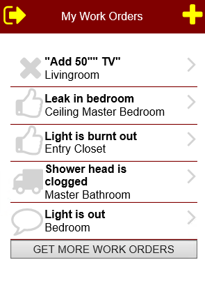

<table>
			    <tr>
			      <td>
				   ASNA Monarch&#174; Framework 10.0 </td>
			    </tr>
</table>

# Expanding List Controls

### What is a DdsExpandingList
Introduced in version 8.0, Monarch Framework now includes the [Expanding List control](amfDdsExpandingListClass.html) which expands on the functionality provided by the [DdsExpandingList](amfUnderstandingLists.html) as explained below.

**Applicability:** These controls can be used exclusively in Mobile RPG pages/apps.

### The Mechanics of a DdsExpandingList
When initially displayed, the Expanding List will show all the records found in the subfile defined by the [SubfileName property](amfDdsExpandingListClassSubfileNameProperty.html) and will append a button indicating that more records are available (see [MoreItemsText property](amfDdsExpandingListClassMoreItemsTextProperty.html)). When the user presses the button, the list will request more subfile records and will append these to the ones already shown on the screen. The user can continue pressing the button until there are no more records to be shown. When the end of the records is reached, i.e. the program does not add any more records to the subfile, the list will replace the button with a label indicating the end of the list has been reached (see [EndOfListText property](amfDdsExpandingListClassEnOfListTextProperty.html)).

A DdsExpandingList can display its items similarly to the DdsExpandingList types of Navigation and CheckBox (see [ListType property](amfDdsExpandingListClassEnOfListTextProperty.html)).

#### Feeding More Records
The RPG program using the DdsExpandingList needs to be prepared to receive a request for additional records through the use of the Mobile RPG Handler's <code>READ</code> and <code>WRITE</code> opcodes.

When a record format is read, it normally returns all of the input fields populated with whatever the user provided on the mobile device.

The behavior of a record format containing an Expanding List will vary depending on whether the user entered data and proceeded normally or requested that the list expand by pressing the Get-more-items button. When the user presses the button, the <code>READ</code> operation will return to the RPG program with the <code>EOF</code> indicator turned <code>ON</code> and with no data on the input fields. This is the signal to the program to add more records to the list's subfile. 

Typically, a program uses an <code>EXFMT</code> opcode to write some data to a record format and then read the user input. The <code>EXFMT</code> opcode is equivalent to a <code>WRITE</code> followed by a <code>READ</code>. Because the <code>EXFMT</code> operation does not allow for an <code>EOF</code> indicator, when a program uses a record format with an Expanding list, it should use not <code>EXFMT</code> but the <code>WRITE/READ</code> sequence instead.

#### Limitations
The DdsExpandingList does not use Categories in the same way that DdsList does; it cannot be split into Categories, nor does it have the properties related to categories.

Additionally, when an entry is selected, and the user returns to the list, that entry will be at the top of the list all entries above it will not be visible. The list must be refreshed to show older entries.

### ExpandingList Property Tasks

<table class="TaskTable" border="1" cellspacing="0" cellpadding="0" width="637">
    <tbody>
        <tr>
            <td valign="top" width="185">

**Property** 
</td>
            <td valign="top" width="452">

**Notes** 
</td>
        </tr>
		       <tr>
            <td colspan="2" valign="top" width="185">

**Appearance** 
</td>

        </tr>
		       <tr>
            <td valign="top" width="185">

                    <code> **[ChevronIconID](amfDdsExpandingListClassChevronIconIDProperty.html)** </code>

            </td>
            <td valign="top" width="452">

                  ID of the Icon that will be used as a chevron.

            </td>
        </tr> 
		      <tr>
            <td valign="top" width="185">

                    <code> **[DetailAlignment](amfDdsExpandingListClassDetailAlignmentProperty.html)** </code>

            </td>
            <td valign="top" width="452">

                    Sets the Alignment of the Detail within the list.

            </td>
		        </tr> 

		  <tr> 
		   <td colspan="2" valign="top" width="185">

**Behavior** 
</td>
		</tr>	
		<tr>
            <td valign="top" width="185" style="height: 23px">

                    <code> **[SelectChevronKey](amfDdsExpandingListClassSelectChevronKeyProperty.html)** </code>

            </td>
            <td valign="top" width="452" style="height: 23px">

                    Sets the AidKey pressed when a chevron is selected by a 
					user.</td>
        </tr>
		 <tr>
            <td valign="top" width="185" style="height: 23px">

                    <code> **[SelectItemKey](amfDdsExpandingListClassSelectItemKeyProperty.html)** </code>

            </td>
            <td valign="top" width="452" style="height: 23px">

                    Sets the AidKey pressed when a list item is selected by a 
					user.</td>
        </tr>
		        <tr>
            <td valign="top" width="185">

                    <code> **[ListType](amfDdsExpandingListClassListTypeProperty.html)** </code>

            </td>
            <td valign="top" width="452">
             An enumeration the sets the type of the list: Checkbox or Navigation</td>
        </tr>

		  <tr> 
		   <td colspan="2" valign="top" width="185">

**Data** 
</td>
		</tr>
		        <tr>
            <td valign="top" width="185">

                <code> **[ClearIndicator](amfDdsExpandingListClassClearIndicatorProperty.html)** </code>   
            </td>
            <td valign="top" width="452"> 
                   Sets the clear indicator for the list's underlying subfile.

            </td>
        </tr>
       		        <tr>
            <td valign="top" width="185">

                    <code> **[DetailField](amfDdsExpandingListClassDetailFieldProperty.html) 
					&amp; [DetailFieldLength](amfDdsExpandingListClassDetailFieldLengthProperty.html)** </code>

            </td>
            <td valign="top" width="452">

                    These properties define a character field whose runtime value is used to get the text content of the Detail area.

            </td>
        </tr>
		    <tr>
            <td valign="top" width="185">

 **<code>[NavigableField](amfDdsExpandingListClassNavigableFieldProperty.html)</code>** 

            </td>
            <td valign="top" width="452">

                    This property defines a character field whose runtime 
					value is used to set the value for the address to navigate 
					to when a list item or chevron is tapped. The special value <code> ***TRUE** </code> is used to 
					indicate that all items should be navigable.</td>
        </tr>

		<tr>
            <td valign="top" width="185" style="height: 23px">

                    <code> **[SelectedField](amfDdsExpandingListClassSelectedFieldProperty.html)** </code>

            </td>
            <td valign="top" width="452" style="height: 23px">

                  (Required)  Displays whether the record is selected (charfield).

            </td>
        </tr>
	<tr>
            <td valign="top" width="185" style="height: 23px">

                    <code> **[SelectedItemField](amfDdsExpandingListClassSelectedItemFieldProperty.html)** </code>

            </td>
            <td valign="top" width="452" style="height: 23px">

                   This field belongs to the parent record and contains the value or text of the selected item.

            </td>
        </tr>
        <tr>
            <td valign="top" width="185" style="height: 44px">

                    <code> **[SubfileControlName](amfDdsExpandingListClassSubfileControlNameProperty.html)** </code>

            </td>
            <td valign="top" width="452" style="height: 44px">

                    The name of the subfile control record format used for the list data.

            </td>
        </tr>
        <tr>
            <td valign="top" width="185">

                    <code> **[SubfileName](amfDdsExpandingListClassSubfileNameProperty.html)** </code>

            </td>
            <td valign="top" width="452">

                    The name of the subfile record format used for the list data.

            </td>
        </tr>
        <tr>
            <td valign="top" width="185">

                    <code> **[TextField](amfDdsExpandingListClassTextFieldProperty.html) &amp; 
					[TextFieldLength](amfDdsExpandingListClassTextFieldLengthProperty.html)** </code>

            </td>
            <td valign="top" width="452">

                    These properties define a character field whose runtime value is used to get the text content of the Text area.

            </td>
        </tr>
        <tr>
            <td valign="top" width="185">
 **<code>[ValueField](amfDdsExpandingListClassValueFieldProperty.html)</code>
									&amp; <code>[ValueFieldLength](amfDdsExpandingListClassValueFieldLengthProperty.html)</code>** 
                            </td>
            <td valign="top" width="452">

                    These properties define hidden fields that may contain data the program will need.

            </td>
        </tr>
		  <tr> 
		   <td colspan="2" valign="top" width="185">

**Image** 
</td>
		</tr>
		        <tr>
            <td valign="top" width="185">

                    <code> **[IconID](amfDdsListClassIconIDProperty.html)** </code>

            </td>
            <td valign="top" width="452">

                   Gets or sets the ID to be used in the Icon-style chevron.

            </td>
        </tr>
			<tr>
            <td valign="top" width="185">

                    <code> **[ImageDirectory](amfDdsListClassImageDirectoryProperty.html)** </code>

            </td>
            <td valign="top" width="452">

                  Sets the directory where the chevron image is located.

            </td>
			</tr>		
			<tr>
            <td valign="top" width="185">

                    <code> **[ImageName](amfDdsListClassImageNameProperty.html)** </code>

            </td>
            <td valign="top" width="452">

                  Sets the name of the image file that will be displayed on the list entries.

            </td>
			</tr>
						<tr>
            <td valign="top" width="185">

                    <code> **[ImageLocation](amfDdsListClassImageLocationProperty.html)** </code>

            </td>
            <td valign="top" width="452">

                Sets the location of the images within the list's items.

            </td>      
			</tr>
    </tbody>
</table>

### Example Code
Below are segments of a program populating the DdsExpandingList shown above, assume the list is in a record called <code>FmtWork</code>
:
					<pre class="prettyprint"><code class="RPG">0001.00 H DFTACTGRP(*NO) ACTGRP(*NEW)                                    
0002.00 FRARESIDENTCF   E             WORKSTN Handler('MOBILERPG')       
0003.00 F                                     INFDS(Feedback)            
0004.00 F                                     SFile(ItemsSfl:ItemsRrn)   
. . . .
0090.00 C*********************************************************************   
0091.00 C* Loop forever displaying the main menu 
0092.00 C*********************************************************************   
0093.00 C                   DoW       Not *INLR                                  
0094.00 C                   ExSr      LoadMyList                                 
0095.00                                                                          
0096.00 C                   Write     FmtWork                                     
0097.00 C                   Read      FmtWork                                89  
0098.00 C                   DoW       *In89                                      
0099.00 C                   ExSr      GrowMyList                                   Append more recs
0100.00 C                   Read      FmtWork                                89  
0101.00 C                   EndDo                                                
0102.00                                                                         
0103.00 C                   Select                                              
0104.00 C                   When      *In05                                     
0105.00 C                   ExSr      ShwRec                                    
0106.00 C                   When      *In06                                     
. . . .
0118.00  **********************************************************   
0119.00  * Load My work orders into the List subfile                  
0120.00  **********************************************************   
0121.00 C     LoadMyList    BegSr                                     
0122.00 C                   Eval      *In99 = *On                                  Clear the list ..
0123.00 C                   Write     ItemsSfc                                     ... Subfile
0124.00 C                   Eval      ItemsRrn = 0                                 Start at 1st RRN
0125.00 C     MyPersonId    SetLL     RAWOL02                         
0126.00 C                   ExSr      GrowMyList                                   Load some records
0127.00 C                   Eval      *In99 = *Off                                 Write the list ..
0128.00 C                   Write     ItemsSfc                                     ... Subfile
0129.00 C                   EndSr                                     
0130.00                                                             
0131.00  ********************************************************** 
0132.00  * Load up to 20 of my work orders into the List subfile        
0133.00  ********************************************************** 
0134.00 C     GrowMyList    BegSr                                   
0135.00 C                   Eval      recCount = 20           
0136.00 C     MyPersonId    ReadE(N)  RAWOL02                       
0137.00 C                   DoW       Not %EOF(RAWOL02)             
0138.00 C                   Eval      ItemsRrn += 1                 
0139.00 C                   Eval      Cookie01 = WOID               
0140.00 C                   ExSr      SetStIcon                     
0141.00 C                   Write     ItemsSfl                      
0142.00 C                   Eval      recCount = recCount - 1       
0143.00 C                   If        recCount = 0                  
0144.00 C                   Leave                                   
0145.00 C                   EndIf                                   
0146.00 C     MyPersonId    ReadE(N)  RAWOL02                       
0147.00 C                   EndDo                                   
0148.00 C                   EndSr                                   
. . . .
</code></pre>

In addition to turning <code>ON</code> the <code>EOF</code> indicator on the <code>READ</code> operation when a list is being expanded, Mobile RPG also reports the SubfileName for the list that requested the additional records in the feedback area. This feedback value is particularly useful if the record format on the <code>READ</code> operation contains more than one list. The following program segment shows this feature:
<pre class="prettyprint"><code class="RPG">0001.00 H DFTACTGRP(*NO) ACTGRP(*NEW)                                    
0002.00 FRARESIDENTCF   E             WORKSTN Handler('MOBILERPG')       
0003.00 F                                     INFDS(Feedback)            
0004.00 F                                     SFile(ItemsSfl:ItemsRrn)   
. . . .
0053.00 D*********************************************************************                        
0054.00 D*   FeedBack Area                                                                            
0055.00 D*********************************************************************                        
0056.00 DFeedBack         DS                                                                          
. . . .
0057.00  * Input/Output Feedback Information                                                          
0064.00 D IO_RCD_FMT            261    270                                         * Rcd format name  
0065.00 D DEV_CLASS             271    272                                         * Device class     
0066.00 D IO_PGM_DEV            273    282                                         * Pgm device name  
. . . .
0090.00 C*********************************************************************   
0091.00 C* Loop forever displaying the main menu 
0092.00 C*********************************************************************   
0093.00 C                   DoW       Not *INLR                                  
0094.00 C                   ExSr      LoadMyList                                 
0095.00                                                                          
0096.00 C                   Write     FmtWork                                     
0097.00 C                   Read      FmtWork                                89  
0098.00 C                   DoW       *In89                                      
0098.01 C                   If        IO_RCD_FMT = 'ITEMSSFL  '
0099.00 C                   ExSr      GrowMyList                                   Append more recs
0099.01 C                   Else
0099.02 C                   ExSr      GrowList2                                    Append more recs
0099.03 C                   EndIf
0100.00 C                   Read      FmtWork                                89  
0101.00 C                   EndDo                                                
. . . .
</code></pre>						

