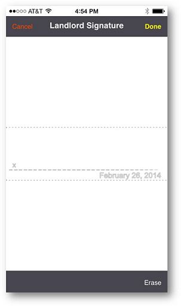
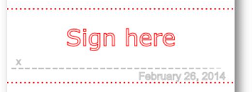
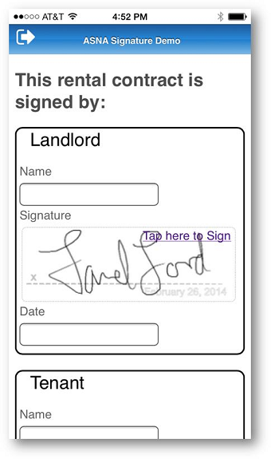

<table>
			    <tr>
			      <td>
				   ASNA Monarch&#174; Framework 10.0</td>
			    </tr>
</table>

# Signature Controls

### What is a DdsSignature?
A [DdsSignature control](amfDdsSignatureClass.html) is used to fulfill the common business need of recording signatures directly through a mobile device. These controls allow users to write their signatures directly onto the Mobile Site (and from there be saved or erased) or to display previously recorded signatures for comparison purposes.  

As of version 9.0 DdsSignatures can store signatures either as SVGs or .JPEGs, for more detail see [DdsSignature Data Storage Considerations](amfUnderSignatureDataStorage.html).

**Applicability:** These controls can be used in Monarch, Wings, and Mobile RPG pages/apps.

### The Mechanics of a DdsSignature
Most of the signature control's work is done on the Signature Editor canvas, which is opened when a user taps the Signature link.

- The Signature Editor has five significant components: The **Cancel** , 
 **Done**  and **Erase**  Buttons, the title, and the signature area. The signature 
					area is centered, preserving the aspect ratio of the signature.
- Also note that (optionally) the date is set as part of the signature (and cannot be erased).
- All labels 
				(buttons, titles, and warnings) are user-defined, and CSS styles are given to customize 
				styles.
- The color of the 'pen' is always black and the background of the signature is always white (this produces 
				a smaller image).
- The 'X' and the dashed-line are not part of the signature.

### The DdsSignature Control in Action
The function of the Signature Control is as follows:

1. When a DdsSignature control is displayed and it is configured to allow the user to sign, it shows
					like the following image (second input-capable field in the DdsRecord):

2. Tapping on the signature does nothing (to allow user to scroll the page), avoiding damaging a previously 
					signed scribble.
3. When the user taps on the "Tap here to Sign", the following page is presented.

4. If the user starts signing outside the signature area, the page displays a warning in large, flashing
					red text to let them know where they should be signing. 
			    	As soon as the user starts signing in the right area, or taps the **Erase**  button, the 
					warning goes away.

5. The user may rotate the phone to set it in landscape orientation, getting more space to sign.
6. If **Done**  is tapped, the signature will be presented along with the rest of the DdsRecord fields

### DdsSignature Property Tasks
<table class="TaskTable" border="1" cellspacing="0" cellpadding="0" width="637">
	  <tbody>
          <colgroup>
           <col width="30%" />
           <col width="70%" />
          </colgroup>
          <tr><th>Property</th>
          <th>Description</th>
          </tr>
		<tr>
            <td colspan="2" valign="top">

**Appearance** 
</td>
        </tr>
           <tr>
            <td> **<code>[AspectRatio](amfDdsSignatureClassAspectRatioProperty.html)</code>** 
            </td>
            <td>Sets the aspect ratio of the signature control.  Defaults to 3:1.</td>
          </tr>
			 <tr>
            <td> <code> **[DateStampWhenSigning](amfDdsSignatureClassDateStampWhenSigningProperty.html)** </code>
            </td>
            <td>Determines whether or not to display a watermark of the current date while the user is on the Signature Editor.</td>
          </tr>
		  <tr>
            <td> <code> **[InvalidEmptySignatureErrorText](amfDdsSignatureClassInvalidEmptySignatureErrorTextProperty.html)** </code>
            </td>
            <td>Sets the text to be displayed if the user accepts without 
			signing.</td>
          </tr>

		<tr>
            <td> <code> **[PenDownOutideSignatureWarningText](amfDdsSignatureClassPenDownOutsideSignatureWarningTextProperty.html)** </code>
            </td>
            <td>Sets the text to be displayed if pen input is detected outside the signature area.</td>
          </tr>
            <tr>
            <td style="width: 304px"> <code> **[SignatureIsTooElaborateWarningText](amfDdsSignatureClassSignatureIsTooElaborateTextProperty.html)** </code>
            </td>
            <td>Sets the text to be displayed if the signature is too complex.</td>
            </tr>
		<tr>
            <td> <code> **[SignEditorCancelButtonText](amfDdsSignatureClassSignEditorCancelButtonTextProperty.html)** </code>
            </td>
            <td>Sets the Cancel Button text for the Signature Editor.</td>
         </tr>
		 <tr>
            <td> <code> **[SignEditorDoneButtonText](amfDdsSignatureClassSignEditorDoneButtonTextProperty.html)** </code>
            </td>
            <td>Sets the text for the Done button in the Signature Editor.</td>
          </tr>
		  <tr>
            <td> <code> **[SignEditorEraseButtonText](amfDdsSignatureClassSignEditorEraseButtonTextProperty.html)** </code>
            </td>
            <td>Sets the text for the Erase button of the Signature Editor.</td>
          </tr>
		  <tr>
            <td style="height: 31px"> <code> **[SignEditorTitleText](amfDdsSignatureClassSignEditorTitleTextProperty.html)** </code>
            </td>
            <td style="height: 31px">Sets the title text for the Signature Editor.</td>
          </tr>
<tr>
            <td style="height: 31px"> <code> **[SignLinkText](amfDdsSignatureClassSignLinkTextProperty.html)** </code>
            </td>
            <td style="height: 31px">Sets the text on the Sign link.</td>
          </tr>
		<tr>
            <td colspan="2" valign="top" width="185">

**Behavior** 
</td>
        </tr>
<tr>
            <td><code> **[
              Protect](amfDdsDataFieldClassProtectProperty.html)** </code>
            </td>
            <td>Protects signature from user interaction. (Inherited from 
			DdsDataField.)</td>
          </tr>
<tr>
            <td> <code> **[Usage](amfDdsDataFieldClassUsageProperty.html)** </code>
            </td>
            <td>Specifies if this field is output-only, input-only (both), or hidden. (Inherited from DdsDataField.)</td>
          </tr>
		<tr>
            <td colspan="2" valign="top" width="185">

**External Description** 
</td>
        </tr>

        <tr>
			<td> <code> **[ValueField](amfDdsSignatureClassValueFieldProperty.html)** </code>
            </td>
            <td>(Required) Sets the name of the field where the signature data will be 
			stored.</td>
        </tr>
<tr>
            <td> <code> **[ValueFieldLength](amfDdsSignatureClassValueFieldLengthProperty.html)** </code></td>
            <td>Sets the length of the field where the signature data will be 
			stored.</td>
          </tr>
		<tr>
            <td colspan="2" valign="top" width="185">

**Layout** 
</td>
        </tr>
		<tr>
	<td valign="top" width="169">
 **<code><a href="http://msdn.microsoft.com/en-us/library/system.web.ui.webcontrols.webcontrol.height(v=vs.110).aspx">Height</a>
		 &amp;  <a href="http://msdn.microsoft.com/en-us/library/system.web.ui.webcontrols.webcontrol.width(v=vs.110).aspx">Width</a></code>** 
	</td>
	<td valign="top" width="468">
		These properties set the height and width of the control in whichever unit is specified (pixels, by default).</td>
</tr>
</tbody>
</table>

