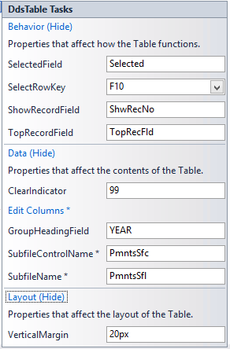

<table>
			    <tr>
			      <td>
				   ASNA Monarch&#174; Framework 10.0
				   </td>
			    </tr>
</table>

# Table Controls

### What is a DdsTable?
ASNA Mobile support includes the [DdsTable control](amfDdsTableClass.html) which greatly simplifies the creation of visually appealing, straightforward data tables.

**Applicability:** These controls can be used exclusively in Mobile RPG apps.

### Changes in 8.0

- New Properties &#8211; 
							<ul>
								<li><code> **SelectedRowValue** </code> &#8211; allows users to specify the value to be passed to the RPG program in 
						the <code>SelectedField</code> to identify that the Row was selected as opposed to a selectable column (previously this was always '1').
- <code> **HeadingFieldName** </code> &amp; <code> **HeadingFieldLength** </code> &#8211; These properties allow developers to programmatically set the
								headings for columns.

</li>
						<li>New Column Type &#8211; <code> **IconColumn** </code> &#8211; Displays an icon from the [IconID Collection](amfIconIDCollection.html).

- **Properties IconColumn shares with other ColumnTypes:**
- **<code>CssClass</code>**  &#8211; CSSClass for the entire column.
- **<code>Heading</code>**  &#8211; Title which will be displayed in the header row.
- **<code>VisibleCondition</code>**  &#8211; Determines if the column should be displayed.
- **<code>FieldLength</code>**  &#8211; Length of the field specified in <code>FieldName</code>.
- **<code>FieldName</code>**  &#8211; Name of the CharField where the IconID is specified.
- **New Properties Specific to IconColumns:**
- **<code>CssClassIcon</code>**  &#8211; CSSClass of the icon itself.
- **<code>IconForeColor</code>**  &#8211; Color used to paint the icon.
- **<code>IconHeight</code>**  &#8211; Height of the icon.
- **<code>IconID</code>**  &#8211; Identifies which Icon to use from the 
								[IconID Collection](amfIconIDCollection.html).  This takes precdecence over programattical specified values.
- **<code>IconWidth</code>**  &#8211; Width of the icon.
- **<code>SelectedValue</code>**  &#8211; Height of the icon. Value to be passed to the RPG program in the
								<code>SelectedField</code> to identify the Icon that the user has selected via click or touch.

</li>
							<li><code>CssClassHeading</code> can now be set for each column, rather than imposing a single universal style.</li>
							<li>[DdsTable Editing](amfUnderstandingTablesEdit.html) has been added, allowing users to modify the contents of specific
								DdsTable cells</li>
						</ul>

### The Mechanics of a DdsTable
The DdsTable control draws its data from a subfile, but creates a more mobile friendly user interface, as well as providing a simpler design experience through the Tasks and Edit Columns dialogs.

When a DdsTable is added to a page, the DdsTable Tasks dialog (below) will open immediately and prompt the developer to provide key properties that shape the behavior, layout, and data of the table.

### DdsTable Property Tasks
Here are the DdsTable properties used to establish the core subfile and other interesting properties:   
<table class="TaskTable" border="1" cellspacing="0" cellpadding="0" width="637">
    <tbody>
        <tr>
            <td valign="top" width="169" align="center">

 **Property** 

            </td>
            <td valign="top" width="468" align="center">

 **Notes** 

            </td>
        </tr>
				  <tr>
            <td colspan="2" valign="top">

**Behavior** 
</td>
			</tr>
			        <tr>
            <td valign="top" width="169">

                    <code> **[SelectedField](amfDdsTableClassSelectedFieldProperty.html)
                     &amp; [SelectRowKey](amfDdsTableClassSelectRowKeyProperty.html)** </code>

            </td>
            <td valign="top" width="468">

                    These properties define the behavior of the table, setting a reaction to a cell being clicked or touched.</td>
        </tr>
		<tr>
            <td valign="top" width="169">
                    <code> **[ShowRecordField](amfDdsTableClassShowRecordFieldProperty.html)** </code>      
            </td>
            <td valign="top" width="468">
                    This property defines a decimal field that contains the RRN of the selected records.     
            </td>
        </tr>
		<tr>
            <td colspan="2" valign="top">

**Data** 
</td>
			</tr>
			        <tr>
        	<td><code> **[ClearIndicator](amfDdsTableClassClearIndicatorProperty.html)** </code>
        	</td>
        	<td>Sets the clear indicator for the subfile that provides data for the table.</td>
        </tr>
		      <tr>
            <td valign="top" width="169">
 **Edit Columns** 
            </td>
            <td valign="top" width="468">
                    This link represents the collection of columns that the table uses; its contents and 
					effects are described below.</td>
        </tr>
                <tr>
            <td valign="top" width="169">
                    <code> **[GroupHeadingField](amfDdsTableClassGroupHeadingFieldProperty.html)** </code>
            </td>
            <td valign="top" width="468">
                    Sets the field to use as a heading for column groups.</td>

</tr>
        <tr>
            <td valign="top" width="169">

                    <code> **[SubfileControlName](amfDdsTableClassSubfileControlNameProperty.html)
                     &amp; [SubfileName](amfDdsTableClassSubfileNameProperty.html)** </code>

            </td>
            <td valign="top" width="468">

                    These properties define the underlying subfile that provides the table data.

            </td>
        </tr>
		  						  <tr>
            <td colspan="2" valign="top">

**Layout** 
</td>
</tr>
		 <tr>
            <td valign="top" width="169">
                    <code> **[VerticalMargin](amfDdsTableClassVerticalMarginProperty.html)** </code>
            </td>
            <td valign="top" width="468">
                    Sets a value in any web unit that the end-user browser or device will reserve as a vertical margin. 
					The DdsTable will take up the remainder of the available space, up to its full size.</td>
        </tr>
<tr>
	<td valign="top" width="169">
		<code> **[the Column Collection Editor](http://msdn.microsoft.com/en-us/library/system.web.ui.webcontrols.webcontrol.height(v=vs.110).aspx">Height</a>
		 &amp;  <a href="http://msdn.microsoft.com/en-us/library/system.web.ui.webcontrols.webcontrol.width(v=vs.110).aspx">Width</a>** </code>
	</td>
	<td valign="top" width="468">
		These properties set the height and width of the control in whichever unit is specified (pixels, by default).</td>
</tr>
    </tbody>
</table>

DdsTable also incorporates a number of properties that can be set for each column in the table; these can be set by clicking on a column in the design view or the Edit Columns link in the Tasks dialog to open <a href="amfUnderColumnList.html). 
<table border="1" cellspacing="0" cellpadding="0" width="637">
    <tbody>
        <tr>
            <td valign="top" width="169" align="center">

 **Property** 

            </td>
            <td valign="top" width="468" align="center">

 **Notes** 

            </td>
        </tr>
        <tr>
            <td valign="top" width="169">

                    <code> **[FieldLength](amfDdsTableClassFieldLengthProperty.html)
                     &amp; [FieldName](amfDdsTableClassFieldNameProperty.html)** </code>

            </td>
            <td valign="top" width="468">

                    These properties define the field that a column's data is taken from.

            </td>
        </tr>
        <tr>
            <td valign="top" width="169">
                    <code> **[Heading](amfDdsTableClassHeadingProperty.html)** </code>
            </td>
            <td valign="top" width="468">
                    Sets the heading that will be shown on the.</td>
        </tr>
        <tr>
        	<td><code> **[VisibleCondition](http://www.w3schools.com/aspnet/prop_webcontrol_style_cssclass.asp">CssClass</a>** </code>
        	</td>
        	<td>Sets the CssClass used to style this column and its contents.</td>
        </tr>
        <tr>
            <td valign="top" width="169">

            <code> **<a href="amfDdsTableClassVisibleConditionProperty.html)** </code>

            </td>
            <td valign="top" width="468">

            Sets the 
 *RPG indicator*  expression that, when evaluated, determines if the column should be visible.</td>
        </tr>
    </tbody>
</table>

By clicking on the [Edit Columns](amfUnderColumnList.html) option, the developer can customize the content and appearance of individual columns as well.

