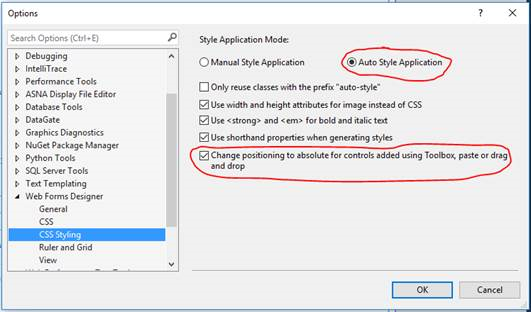

Visual Studio has some Tool Options that assist in using absolute positioning with Wings/Monarch controls. 

From the **Tools** Menu, select **Options** and then open the **Web Forms Designer** node and select the **CSS Styling** section. 

To use absolute positioning on a control by control basis (without changing the overall CSS styles in the Framework.css), select the **Auto Style Application** radio button and the check box **Change Positioning** to **absolute for controls …** . If you have these options selected, every time that you add a control from the Toolbox, the control will appear at the top/left corner of the DdsRecord and then you can drag it to its proper place.

#### See Also
<dl>
        <dd>[Monarch
      Framework ASPX Session Overview](amfconFrameworkASPXSessionOverview.html) </dd>
      <dd>[Job Class](amfJobClass.html)</dd>
<dd>[Program Class](amfProgramClass.html)</dd>
<dd>[
      LocalDataCollection Class](amfLocalDataCollectionClass.html)</dd></dl>

