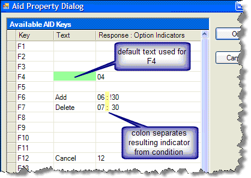

Function key behavior in a web display file is patterned closely to the behavior of the 5250 display file. At the top level are Attention keys and Function keys defined in the Display File ( **ASNA.Monarch.WebDspF.DdsFile** ) followed by keys defined in the record ( **DdsRecord** and **DdsSubfileControl** ). As with the 5250 workstation, Attention keys are distinguished from Function keys in that the former return no data to the logic program.

Unlike the 5250 Workstation's AID key implementation, the Monarch Framework allows the same AID keys to be specified at multiple levels. The hierarchy is [ DdsFile.AttnKeys](amfDdsFileClassAttnKeysProperty.html), [ DdsFile.FuncKeys](amfDdsFileClassFuncKeysProperty.html), [ DdsRecord.AttnKeys](amfDdsRecordClassAttnKeysProperty.html), and [ DdsRecord.FuncKeys](amfDdsRecordClassFuncKeysProperty.html). In other words, if F17 is specified and conditioned for **DdsFile.AttnKeys** and also specified and conditioned for **DdsRecord.FuncKeys** , the description and resulting indicator for F17 from DdsRecord.FuncKeys will be employed. On the other hand, if the condition for F17 in **DdsRecord.FuncKeys** is false, then F17 description and resulting indicator is employed from **DdsFile** . 

When no description is provided for an AID key, Monarch defaults to the following names: *<code>Enter, F1…F24, Clear, Help, PageUp, PageDown, Print,</code> and <code>Reset</code>* . 

### <code>APP_GlobalResources</code> and <code>Monarch.resx</code>

- Websites constructed with the Monarch framework include a folder named **App_GlobalResources** , by default this folder includes only one file: **Monarch.resx** .This process follows a set of .NET localization standards laid out by Microsoft, and may be familiar to .NET developers.
- Monarch.resx contains the detailed values for Function Key labels, and they can be modified within it.

The Monarch.resx values are written in English. To include an additional language option:

1. Copy Monarch.resx.
2. Add the appropriate <code> **LanguageIndentifier** </code> string to the filename. For example standard French would be <code>Monarch.fr-FR.resx</code>, and German would be <code>Monarch.de-DE.resx</code>. (For a complete explanation and listing of <code>LanguageIdentifier</code> strings, consult the [ WebConfig Considerations](http://msdn.microsoft.com/en-us/library/cc230847(v=prot.10).aspx">MSDN LanguageIdentifier reference</a>.)
3. Translate the values in the locally-named .resx to the desired language.

Once new Resouce files have been created and their contents translated, they can be set to override the default Resource files in three ways:

- By the browser (most browsers let users select language and culture settings, usually under **Tools** or **Options** .)
- Declaratively, by adding a <code> **&lt;globalization&gt;** </code> element to the **Web.config** file and setting the <code> **Culture** </code> and <code> **UICulture** </code> attributes.
- Programmatically, by adding code to the **Web.config** file.

For more complete details on setting localization and globalization for .NET applications (and therefore Wings, Monarch, and Moble RPG applications and pages), users can consult the Microsoft Developer&#39;s Network references on <a href="http://msdn.microsoft.com/en-us/library/aa478974.aspx#aspnet-globalarchi_topic2">Globalization Architecture</a> or <a href="http://msdn.microsoft.com/en-us/library/ms227427.aspx">Global Resources.</a>

Also refer to the <a href="amfconWebConfigConsiderations.html) topic for more information on the AppSettings.config file.

#### Using the AID Property Dialog
The <code>AttnKeys</code> and <code>FuncKeys</code> properties are tokenized strings where the AID key, its description, resulting indicator and condition are separated with semicolons. Although one can readily modify the property string, it is most often easier to do in the AID Property Dialog. This is available whenever you select the ellipsis for either property. Below is an example of the dialog.
<dl><dd></dd></dl>

Notice that there is no text given for F4, so the default will be used. As discussed above, the default will be "F4" or your <code>key="MonarchKeyF4"</code> contained in the AppSetting.Config.

F4, F6, F7, and F12 return resulting indicators of 04, 06, 07, and 12, respectively.

F6 and F7 are conditioned and are not displayed or enabled when their conditions are false. Refer to [ Conditional Properties Overview](amfconConditionalPropertiesOverview.html) for more information on conditioning expressions.

Conditioning expressions can use parentheses for grouping and can use the following operators:
<blockquote dir="ltr">
<code> **&amp;** </code> for <code>AND</code>

<code> **|** </code> for <code>OR</code>

<code> **!** </code> for <code>NOT</code>
</blockquote>

#### Using the DdsButton Control
You can use the [ DdsButton](amfDdsButtonClass.html) control to place an aid key option anywhere on the Web display file (.aspx). **DdsButton** can be used in addition to the buttons in **DdsFile** control or in lieu of them (<code>[DdsFile.BannerStyle](amfDdsFileClassBannerStyleProperty.html)= Hidden</code>). A **DdsButton** is linked to its corresponding AID key by the [ AidKey](amfDdsButtonClassAidKeyProperty.html) property. **DdsButton** can be either of two Styles: Button or Image.

If the corresponding AID key is enabled, then the button will be visible. If the user clicks the button, then the resulting indicator for the AID key (set up in <code> **AttnKeys** </code> and <code> **FuncKeys** </code>) is returned. Additional return information provided by the **DdsButton** includes its [ FieldName](amfDdsButtonClassFieldNameProperty.html) property (returned in the record's [ CursorField](amfDdsRecordClassCursorFieldProperty.html)) and [ VirtualRowCol](amfDdsButtonClassVirtualRowColProperty.html) property (returned in the display file's [ FeedbackCursor](amfWebDisplayFileClassFeedbackCursorProperty.html) property).

#### Next: [Conditional Properties Overview](amfconConditionalPropertiesOverview.html)

#### Previous: [Web Server Controls Overview](amfWebServerControlsOverview.html)

#### See Also
[DdsFile Class](amfDdsFileClass.html) [DdsRecord Class](amfDdsRecordClass.html) [DdsButton Class](amfDdsButtonClass.html) [ WebConfig Considerations](amfconWebConfigConsiderations.html) [ WebDisplayFile Class](amfWebDisplayFileClass.html)[ Monarch Web Control Indicator Expression Tester](amfMonarchWebControlIndicatorExpressionTester.html)
