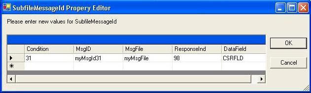

Gets or sets a new instance of an [ ErrMsgIdProperty](amfErrMsgIdPropertyClass.html) object that identifies a message ID number to be associated with this control.

#### Syntax
<pre class="prettyprint"> **BegProp SubfileMessageId Access(*Public) Type([ErrMsgIdProperty](amfErrMsgIdPropertyClass.html))
   BegGet;  BegSet** </pre>

#### Property Values
**ErrMsgIdProperty** object containing the values shown below.

#### Remarks
To set this property at design-time, click on the right of the **SubfileMessageId** property and the **SubfileMessageId Property Editor** will display as shown below. Enter the condition, message Id, message file, response indicators, and data field information. 

- *Condition* : Enter the indicator expression under
        which the message will be displayed. Text cannot be
        specified.
- *MsgID:*  Enter the message identifier for the message
        to be displayed.
- *MsgFile* : Enter the library (optional) and message
        file name as [library/]messagefile.
- *ResponseInd:*  Optionally enter the response
        indicator that will be set *ON. If the response indicator
        is entered, it should be the same as the option indicator
        used to condition the MSGID keyword. After the display of
        the message, this indicator is set *OFF. However, if the
        response indicator is also specified on another keyword,
        the on/off setting is based on the results of that
        function.
- *DataField* : Optionally enter the field name that
        contains one or more substitution values used as data
        fields within the predefined message. The substitution
        values take the place of the substitution variables defined
        in the message text when the message initially defined.
        This field must exist in the record format and defined as
        *Char.

In the example below, if *IN31 is *ON, myMsgId31 in myMsgFile will be displayed for DataField CSRFLD and *IN98 will be set *ON.

 

#### Requirements
**Namespace:** [ASNA.Monarch.WebDspF](amfWebDspFNamespace.html)

**Assembly:** ASNA.Monarch.WebDspF.DLL

**Platforms:** Windows Server 2012, Windows Server 2012 R2, Windows Server 2016, Windows 7, Windows 8 Pro, Windows 10 Pro

#### See Also
[ DdsSubfileControl Class](amfddsSubfileControlClass.html)   [ DdsSubfileControl Class Members](amfddsSubfileControlClassMembers.html)   [Conditional Properties Overview](amfconConditionalPropertiesOverview.html)  [ ASNA.Monarch.WebDspF Namespace](amfWebDspFNamespace.html) [ ErrMsgIdProperty Class](amfErrMsgIdPropertyClass.html) 
