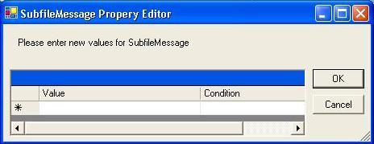

Gets or sets a new instance of an [ ErrMsgProperty](amfErrMsgPropertyClass.html) object that identifies a message to be associated with this record.

#### Syntax
<pre class="prettyprint"> **BegProp SubfileMessage Access(*Public) Type([ErrMsgProperty](amfErrMsgPropertyClass.html))
   BegGet;  BegSet** </pre>

#### Property Values
**ASNA.Monarch.WebDspF.ErrMsgProperty** object continuing the conditional property values for the record.

#### Remarks

To set this property at design-time, click on the right of the **SubfileMessage** property and the SubfileMessage Property Editor will display as shown below. Enter the value and the condition controlling the message. See [Conditional Properties Overview](amfconConditionalPropertiesOverview.html) for more information.

 

#### Requirements
**Namespace:** [ASNA.Monarch.WebDspF](amfWebDspFNamespace.html)

**Assembly:** ASNA.Monarch.WebDspF.DLL

**Platforms:** Windows Server 2012, Windows Server 2012 R2, Windows Server 2016, Windows 7, Windows 8 Pro, Windows 10 Pro

#### See Also
[ DdsSubfileControl Class](amfddsSubfileControlClass.html)   [ DdsSubfileControl Class Members](amfddsSubfileControlClassMembers.html)   [Conditional Properties Overview](amfconConditionalPropertiesOverview.html)  [ ASNA.Monarch.WebDspF Namespace](amfWebDspFNamespace.html) 
