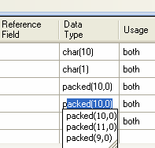
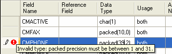

To set the data type of a field in Database File Definition Designer, you must enter a data type keyword, and optional parameters corresponding to the type, in the Data Type cell of the field row, as shown below.

As you enter the type, a "most recently used" list of similarly named types may be shown, as with the Packed type in the above example, which can help you quickly enter the type definition.

Also, the Data Type grid cell validates your entry, and displays an error icon on the row if your data type selection is invalid.

Placing your mouse cursor over the error icon will display a pop-up panel detailing the problem, as shown below. The error in this case is that the user has entered an invalid value for the precision of the Packed field.

#### Section summary:

- [Add New Database File Definition](dgCreateorOpenaProject.htm" target="Main">Create or Open a Datagate Project</a>
- <a href="dgAddNewFileDefinition.html)
- [Open the Database File Definition Designer](dgOpenFDD.html)
- [Add Field(s) to the Record Format](dgAddFieldtoRecordFormat.html)
- [Add Key(s) to the Record Format](dgAddKeytoRecordFormat.html)
- [Add Select/Omit Rule](dgAddSelectOmitRule.html)
- [Create the Final File](dgCreatetheFinalFile.html)
- [File Types, Data Type Keywords and Parameters](dgFileTypesandDataTypes.html)
- [The File Definition Document Editor](dgFileDefinitionDocumentEditor.html)

