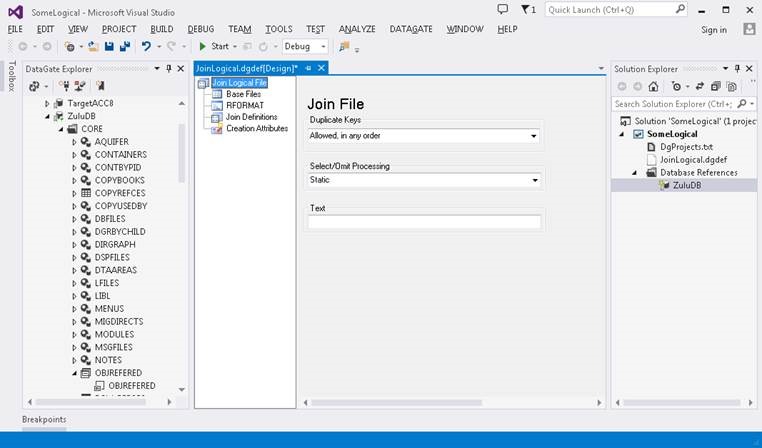
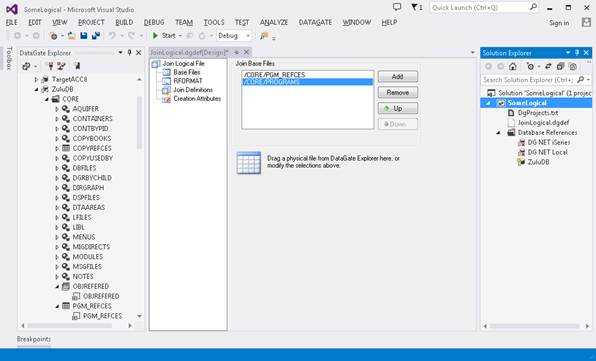
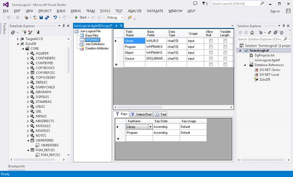
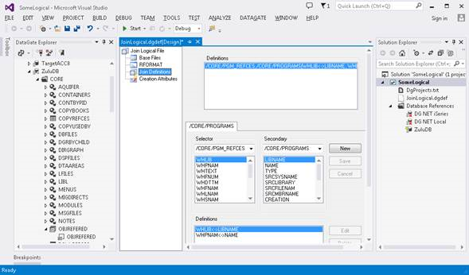
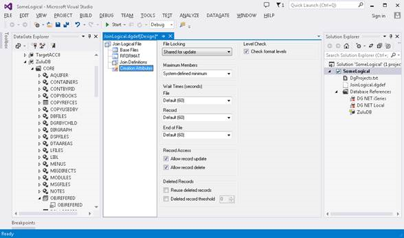
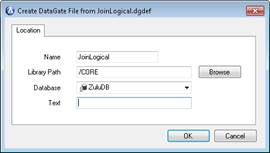
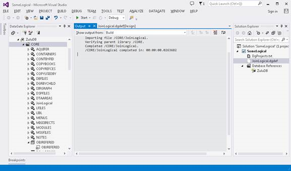

New Join Logical files can be created through DataGate Studio by following these steps (images are from Visual Studio 2014):

#### To Add a New Join Logical File

1. [Create or Open a DataGate project/solution](dgCreateOrOpenaProject.html)
2. In Solution Explorer, select the **project**  in which the new file definition will be added.

Note that if the solution is composed of only one project, Solution Explorer may only show that project node, and no solution node. If more than one project exists in the solution, the project nodes will be shown under the root solution node.
3. Select **Add New Item**  from the Project menu. The Add New Item dialog is displayed.

The **Add New Item** command is shown on the **Project** menu only when a project is selected in Solution Explorer. If you don't see the command, make sure you have a project or solution open in Solution Explorer, and that the correct project is selected.
4. Select the new **file definition template**  for Join Logical files.

DataGate items will only be shown if the **Add New Item** command is executed while a DataGate project is selected in Solution Explorer. If you don't see the DataGate category in the Add New Item dialog, Cancel the dialog and make sure you have selected a DataGate project in Solution Explorer.
5. Modify the **source file name** , if desired.

The source file name is simply the name of the source file containing the file definition. This name does not correspond to any particular database object, and will not be used as the name of the created file (unless that is desired). Use a descriptive name that will reflect the usage of the file definition in the development project.
6. Click **Add**  to create the new Join Logical file and add it to the project.

The new Join Logical is created in a file in the project folder with the extension " **.dgdef** ". The file definition added to the project can now be opened for editing by double-clicking on the file in Solution Explorer.
7. In the Solution Explorer, add or remove references to correctly refer to 
			your database (in the Database References folder).

8. Select the **Base Files**  node on the new definition and drag and drop the base file.

9. Select the **RFORMAT**  node and add the fields and keys that you need 
			(as well as any SELECT or OMIT statements that are required).

10. On the **Join Definition**  node, select the Selector/Secondary combinations you need:

11. Select any **Creation Attributes**  the Join will require:

12. Finally, right mouse on your file definition on solution explorer 
			and select "Create File...", entering the required values on the dialog.

#### Section summary:

- [Create or Open a DataGate Project](dgCreateOrOpenaProject.html)
- [Add New Database File Definition](dgAddNewFileDefinition.html)
			<ul><li>[Add a Join Logical File](dgAddaJoinLogical.html)

</li>
			<li>[Open the Database File Definition Designer](dgOpenFDD.html)
			</li>
			<li>[Add Field(s) to the Record Format](dgAddFieldtoRecordFormat.html)
			</li>
			<li>[Add Key(s) to the Record Format](dgAddKeytoRecordFormat.html)
			</li>
			<li>[Add Select/Omit Rule](dgAddSelectOmitRule.html)
			</li>
			<li>[Create the Final File](dgCreatetheFinalFile.html)
			</li>
			<li>[File Types, Data Type Keywords and Parameters](dgFileTypesandDataTypes.html)
			</li>
			<li>[The File Definition Document Editor](dgFileDefinitionDocumentEditor.html)
			</li>
		</ul>

