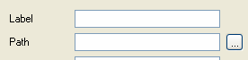

When creating or labeling a database, you can browse for the folder in which to place or find the database by selecting the Browse button ( **...** ) to the right of the Path field, as shown below.

### To Browse for a Database Folder

1. Click the **...**  button to the right of the Path field. A standard windows browsing dialog will display
2. Enter or select the following information to the Browse For Folder dialog box.

#### Display Box:
The folders for the selected server will display. Select the desired folder in which to add a database to.

#### OK Button:
Select **OK** when a folder has been selected or to close the Browse for Folder dialog box and return to the Label Database dialog box.

#### Cancel Button:
Select **Cancel** to abort browsing for a folder.

#### Section summary:

- <a href="dgWorkingwithDatabasesMain.htm" target="Main">Working with Databases</a>
- <a href="dgCreateaNewDatabase.htm" target="Main">Creating a New Database</a>
- <a href="dgLabelingaDatabase.htm" target="Main">Labeling an Existing Database</a>
- <a href="dgChangingaDatabase.htm" target="Main">Changing an Existing Database</a>
- <a href="dgRemovingaDatabase.htm" target="Main">Removing an Existing Database</a>

