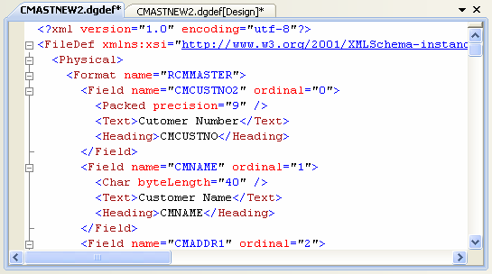

The designer allows you to make changes to an underlying source file. This source file is an XML document, which adheres to the DataGate File Definition XML Schema. If you wish, you can edit the document directly, using the DataGate Studio XML editor. You can even have your file definition open in both the designer and XML editor simultaneously – changes made in one are reflected immediately in the other.

When the file definition is open in the designer view window, you may use the **Code** command on the View menu to open the definition in the XML editor view, as shown below. You can alternately open the source file in the XML editor view by rightclicking on the source file in the DataGate project in Solution Explorer, and selecting the **View Code** command.

DataGate Studio uses the File Definition XML Schema to provide integrated file definition syntax error checking, highlighting, and IntelliSense® features when editing the file definition in the XML editor.

Note that if you make changes in the XML editor that result in an invalid XML document, or a violation of the schema, the design view of the source file may be disabled, since the designer cannot interpret the document. Even so, the XML editor can be handy for making large, "cut and paste"-style changes to a file definition.

#### Section summary:

- [Create or Open a DataGate Project](dgCreateOrOpenaProject.html)
- [Add New Database File Definition](dgAddNewFileDefinition.html)
- [Open the Database File Definition Designer](dgOpenFDD.html)
- [Add Field(s) to the Record Format](dgAddFieldtoRecordFormat.html)
- [Add Key(s) to the Record Format](dgAddKeytoRecordFormat.html)
- [Add Select/Omit Rule](dgAddSelectOmitRule.html)
- [Create the Final File](dgCreatetheFinalFile.html)
- [File Types, Data Type Keywords and Parameters](dgFileTypesandDataTypes.html)
- [The File Definition Document Editor](dgFileDefinitionDocumentEditor.html)

