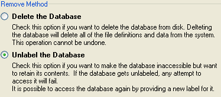

When you no longer need a DataGate for Windows database, you can remove it using DataGate Studio. The **Remove** button within the Work with Databases dialog "unlabels" an existing database, and optionally deletes the files and folders comprising the database from your computer. Similarly, databases can be removed by right-clicking them in the DataGate Explorer treeview and selecting **Remove** .

*Proceed with caution when deleting a database, as all libraries, files, members, and data contained in the database will also be deleted. This operation cannot be undone!* 

Ensure that no applications will be accessing the database that will be removed.

Unlabeling a database retains the contents of the database, while making the database inaccessible. When a database is "unlabeled", the database cannot be accessed. Provide a new label to access the database again.

### To Remove a Database

1. Select **Work with <u>D</u>atabases**  from the DataGate menu. The Work with Databases dialog
					box will display.
2. Double-click on a server in the display box in which the database to remove resides. Select
					the database to remove. The server, label, path, description and other options of the selected
					database will automatically display.
3. In the previous step, if you selected a remote computer, you must make sure that you have
					specified a valid username and password to authenticate access to that computer.

The default value for Username, "*DOMAIN", is a keyword that causes DataGate Studio to use your current Windows Domain logon credentials to authenticate your access to the remote computer. In that case, you may leave the Password field blank. Otherwise, you must enter a user and password that has sufficient access on the remote computer to remove the database.

If you have insufficient authority to remove the database, the command will fail.
4. Select the **<u>R</u>emove**  button to remove the selected database. The Remove a Database dialog
					box will display to confirm the database to remove.

**Note** - The Remove Database Dialog can also be accessed by right-clicking a database in the DataGate Explorer treeview and selecting **Remove** .
5. Select the **<u>D</u>elete the Database**  option to unlabel AND delete the database files and folders.
					Select **Unlabel the Database**  to only unlabel the database, without deleting its files and folders.	

The default selection is Unlabel the Database. Remember that deleting the database causes all data to be permanently lost! A database that is removed by unlabeling only can be recovered by re-labeling.
6. Select the **OK**  button. The database will be removed and you will return to the Work with
					Database dialog box.

#### Section summary:

- <a href="dgWorkingwithDatabasesMain.htm" target="Main">Working with Databases</a>
- <a href="dgCreateaNewDatabase.htm" target="Main">Creating a New Database</a>
- <a href="dgLabelingaDatabase.htm" target="Main">Labeling an Existing Database</a>
- <a href="dgChangingaDatabase.htm" target="Main">Changing an Existing Database</a>
- <a href="dgBrowsingDatabases.htm" target="Main">Browse for a Database Folder</a>

